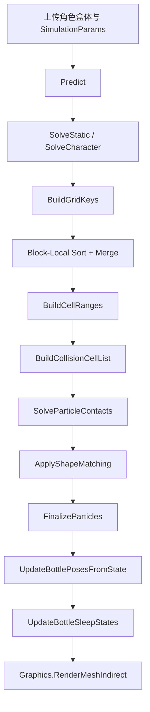

# 可乐瓶堆积撞击效果技术设计文档

## 文档信息

- 版本：v1.6
- 日期：2026-04-13
- 状态：样机已接入场景，当前主路径已收敛到 `block-local sort + merge + directed cell-pair list + bottle-level solver dispatch + 单 pile RenderMeshIndirect`；后续重点转为运行时验证、参数回归和剩余热点继续压缩
- 上游 PRD：`docs/plans/cola-bottle-pile-collision-prd.md`
- 关联实现：`Assets/Project/CS/CokeBottlePbd/`
- 作者：Codex（基于当前仓库实现与需求整理）

## 变更记录

| 版本 | 日期 | 变更内容 |
|------|------|----------|
| v1.6 | 2026-04-13 | broadphase/contact 新增 `collision cell` 过滤层：在 `occupied cell` 基础上筛出真正可能发生接触的 cell，并在 `SolveParticleContacts` 中先看 `collision cell flag` 再决定是否进入邻域 range 扫描，减少稀疏区域的无效 27 邻域遍历。 |
| v1.5 | 2026-04-13 | 继续把主干求解 kernel 收到 bottle-level dispatch：`Predict`、`SolveStaticColliders`、`SolveCharacterCollider`、`SolveParticleContacts` 改为每线程处理一整瓶 6 粒子，进一步降低 dispatch 数量并提升同瓶局部性。 |
| v1.4 | 2026-04-13 | 继续压缩帧尾固定成本：删除独立 `WriteInstanceTransforms` kernel；`UpdateBottlePosesFromState` 对上一帧已休眠且本帧未唤醒的瓶子直接早退，不再重复做姿态拟合和实例矩阵写回。 |
| v1.3 | 2026-04-13 | 继续压缩 iteration 内固定成本：移除迭代内单独的 `GatherBottlePosesPredicted` 调度，改为在 `ApplyShapeMatching` 内按瓶直接从预测位置构姿态并回写 6 粒子，进一步减少一个 kernel dispatch 和一轮 `BottlePoseBuffer` 中间态读写。 |
| v1.2 | 2026-04-13 | 基于外部资料继续收敛优化方向，并先落地一批低风险实现：`occupied cell` 相关 dispatch 改为按真实上限发射；`ApplyShapeMatching` 与 `FinalizeParticles` 从粒子级 dispatch 改为瓶级 dispatch；帧尾 `UpdateBottlePosesFromState` 与实例矩阵写回合并，减少一个 kernel 和一轮 bottle pose 读写。 |
| v1.1 | 2026-04-12 | 将 `terrain` 级活动范围与局部 broadphase 网格窗口正式拆分：`SimulationBounds` 负责世界活动边界与渲染包围盒，`GridBounds` 只负责局部排序型 grid 的 key/index、cell range 与接触查询，避免把整块 terrain 直接映射成稠密 uniform grid。 |
| v1.0 | 2026-04-12 | 已将单 pile 提交路径从 `DrawMeshInstancedIndirect` 收敛到 `RenderMeshIndirect`，并接入单 pile 级 `CullingGroup` 粗剔除；同时把 `sleep frontier` 从全瓶 O(n²) 邻近扫描改为基于现有粒子 grid 的局部预唤醒查询，避免 sleep 优化本身反向制造新的固定成本。 |
| v0.9 | 2026-04-12 | `active set / sleep` 已继续推进到更强的调度层：休眠瓶默认不再进入 grid / broadphase，active frontier 通过角色唤醒与瓶级邻近唤醒维持传播区域，开始真正让 broadphase 与 contact 只服务活跃子集。 |
| v0.8 | 2026-04-12 | 已开始把 `active set / sleep` 从文档路线落到代码：新增 bottle-level `sleep / wake` 数据流，让静止瓶堆减少预测、接触与 shape matching 开销；当前以“统一 solver 内的低频更新”方式落地，不引入双路径物理。 |
| v0.7 | 2026-04-12 | 基于外部资料补充后续优化方向，明确 `radix/block sort`、`active set / sleep`、`collision cell list`、`chunked indirect rendering` 等路线；同时把当前样机默认基线下调为更轻的 `1 iteration / 2 substeps + 阴影默认关闭`，优先先把原型从“明显卡顿”拉回可跑状态。 |
| v0.6 | 2026-04-12 | 排序型 broadphase 第一阶段已落地为 `grid key/index + bitonic sort + cell start/end + occupied cell clear`，同时把调试统计口径改为 `maxCell / occupiedCells / gridBuilds / contacts`，并将调试读回默认改为关闭。 |
| v0.5 | 2026-04-12 | 基于当前样机“场景内明显卡顿”的反馈、现有 benchmark 结果与外部资料，新增性能收敛结论、实现偏差、优化优先级与参考链接。 |
| v0.4 | 2026-04-12 | 新增“角色使用立方体占位模型与盒体交互代理”的约束，统一角色相关碰撞表述。 |
| v0.3 | 2026-04-12 | 新增“暂无瓶子模型，首版先以胶囊体占位”的实现约束，调整资源规格、验收标准和风险描述。 |
| v0.2 | 2026-04-12 | 按 TA 设计文档结构重写技术稿，补齐假设边界、性能预算、美术工作流、风险清单和主动挑战问题。 |
| v0.1 | 2026-04-12 | 初始技术实现稿，覆盖 Buffer、Kernel、约束顺序与每帧数据流。 |

## 当前实现快照（v1.6）

本节用于覆盖下文仍保留的旧版细节描述。若后文某些段落仍出现 `BitonicSort`、`radix sort`、`DispatchIndirect` 或 chunk 化提交流水线等旧/更晚版本表述，以本节为准。

### 1. broadphase / sort

- `BuildGridKeys` 之后当前主路径已改为 `BlockLocalSort + MergeSortedBlocks`，先做组内排序，再做跨 block merge。
- 排序后的 `BuildCellRanges -> BuildCellPairList` 仍是当前 broadphase / contact 连接骨架。
- 当前不再用 `collision cell flag` 做早退过滤，而是为每个 source `occupied cell` 预构建一份 directed `cell-pair list`，只让 contact 扫描真实存在的邻域候选 cell。

### 2. contact 主路径

- contact 主链已切到 `ClearContactAccum -> SolveContactsByCellPairList -> ApplyContactCorrections`。
- `SolveContactsByCellPairList` 以 source `occupied cell` 为调度边界，并只遍历该 cell 对应的 directed `cell-pair list`。
- 当前仍保留 bottle-level `ApplyContactCorrections`，用来避免在 pair 调度里再引入浮点原子累积。

### 3. 数据布局与调度

- 静态数据仍放在 `ParticleStaticBuffer`：`localRestPosition / radius / bottleIndex / localParticleIndex / inverseMass`。
- 运行时主干仍围绕 `PredictedPositionBufferA/B`、粒子状态缓冲、`CellStartBuffer / CellEndBuffer`、`CellPairBuffer / CellPairCountBuffer`、`ContactAccumBuffer` 与 `BottlePoseBuffer` 组织。
- 主干求解 pass 仍以 bottle-level dispatch 为主，但当前版本还没有把调度边界进一步收敛到 active bottle list 或 `DispatchIndirect`。

### 4. 渲染提交

- 渲染路径仍以单 pile、单命令 `RenderMeshIndirect` 为主。
- 当前已接入单 pile 级 `CullingGroup` 粗剔除，但仍不做 chunk 化命令组织和动态 chunk bounds 回读刷新。
- `worldBounds` 仍以整 pile 的 coarse bounds 为主，先保证提交流水线稳定，再为后续更细粒度剔除预留空间。

### 5. 当前残余风险

- `BuildGridKeys + BlockLocalSort + MergeSortedBlocks + BuildCellRanges` 仍然是当前排序型 broadphase 的主要固定开销来源。
- 当前虽已切到 directed `cell-pair list`，但 pair 仍按 source cell 批量消费，并未进一步压到更细的独立 pair kernel 或 active pair compaction。
- 当前仍以单 pile、单命令、单大 bounds 为主，若后续扩到多 pile 或更大区域，仍需继续推进更细粒度的渲染提交与剔除。
- shader/compute 中仍有若干地方把 `ParticlesPerBottle = 6` 和 `ThreadGroupSize = 64` 当作人工同步常量，后续若要开放可变代理粒子数，需要再做一次参数化清理。

## 当前假设

本版没有重新向用户逐项确认平台和预算，因此先按以下假设编写；后续一旦目标平台、镜头语言或视觉标准变化，文档应升版重审。

- 引擎版本：Unity 6 `6000.0.46f1`
- 渲染管线：`URP`
- 目标平台：PC / 主机级 GPU，1080p 内部分辨率，优先保证实时交互
- 规模目标：单个瓶堆区域 `500-1500` 个同款瓶子
- 交互目标：角色走路、奔跑、冲刺都能把瓶堆撞开并产生局部到中尺度传播
- 资源约束：当前暂无正式瓶子模型，首版以单一胶囊体占位网格、单一材质族、单一 archetype 为范围
- 角色约束：当前角色占位模型与交互代理统一使用立方体盒体
- 视觉策略：首版优先可信运动与连锁传播，不优先追求真实玻璃折射、高精度逐瓶刚体和最终瓶身轮廓
- 当前样机事实：`SampleScene` 编辑器短跑实测平均帧时间约 `91.50 ms`、P95 约 `90.12 ms`、最慢帧约 `969.64 ms`，说明当前原型与实时目标之间存在数量级差距，后续文档必须优先服务性能收敛而不是功能扩张
- 当前优化基线：`BottleSimulationConfig_Default` 与场景安装器默认已下调为 `1 iteration / 2 substeps`，并把实例阴影默认关闭；这不是最终量产参数，而是当前样机的轻量 baseline

## 1. 概述

- 效果目标：在场景中放置大量“未来会替换为可乐瓶”的同构占位体，角色进入或撞击时，占位体先验证翻倒、滚动、堆积和冲击传播。
- 核心技术路线：统一 `GPU PBD + neighbor grid + shape matching + 实例化渲染`。
- 与现有系统的关系：当前仓库已经有 `CokeBottlePbd` 最小闭环原型，本文把它整理成可持续迭代的设计约束，而不是另起一条新路线。
- 首版体验重点：让“撞进去之后整堆会被带动”成立，并先用胶囊体占位验证动力学手感，而不是过早绑定最终瓶子外观。

## 2. 技术方案

### 2.1 核心算法与技术选型

#### 选择方案

首发主路径采用“全量统一 `PBD` 求解 + `neighbor grid` 近邻查询 + 实例化渲染”。

选择理由：

- 角色撞击后需要出现传播感，瓶子之间必须持续接触，而不是只在局部几个对象上做假反应。
- 瓶子数量大、形状细长、同构程度高，适合先用粒子簇代理，再以胶囊体占位网格验证整体手感和性能边界。
- 统一 solver 更容易保持“模拟真值”和“渲染真值”一致，不会出现近处一套、远处一套的维护负担。
- 与 Unity 6 `URP` 的 Compute Shader 和 `Graphics.RenderMeshIndirect` 能力匹配，工程上可以先跑通再逐步收敛。

#### 备选方案与排除理由

`CPU Rigidbody + Mesh/Primitive Collider`

- 排除理由：`500+` 瓶子时 CPU 接触成本和稳定性风险高，角色冲撞下更容易爆栈式抖动或帧时失控。

`近景真实物理 + 远景休眠/代理`

- 排除理由：虽然预算更稳，但当前仓库和上游 PRD 已明确收敛为统一物理路径，不再维护混合架构。

`纯视觉假反应 + 关键瓶子受力`

- 排除理由：很难做出“整堆被持续带动”的中尺度传播，用户会明显看出瓶子是分层表演而不是真正堆积。

#### 当前原型与性能收敛结论

当前文档中的主路线仍然成立，但现阶段必须承认一个实现层事实：仓库里的原型还不是“可扩到 500-1500 瓶”的量产架构，而只是“验证统一 solver 手感”的最小闭环。

当前性能问题主要来自以下三点：

1. 固定容量 uniform grid 和 overflow 全扫描路径已经被移除，但当前排序型 broadphase 仍要在每次重建时对全量 `grid key/index` 做 `block-local sort + merge` 与 cell-range 重建；随后还要生成 source `occupied cell` 的 directed `cell-pair list`，因此 broadphase / narrowphase 连接层仍是现阶段主要固定开销之一。
2. 当前默认只在每个 `substep` 的第一个 `iteration` 重建一次 grid，而不是每个 iteration 都重建；这能省掉一部分 broadphase 成本，但会引入 `stale-neighbor` 风险，需要继续用 `PerIteration` 对照验证精度边界。
3. 当前渲染已收敛到单 pile `RenderMeshIndirect + CullingGroup` 粗剔除，但仍是单命令、单大 bounds 的保守路径；如果后续扩到多 pile 或更大范围，仍需要继续推进更细粒度的 bounds 和提交组织。

基于当前样机反馈，本项目的性能优化顺序应调整为：

1. 先去掉 overflow 退化全扫描，建立稳定、可统计的排序型 grid / cell range broadphase。
2. 再做 solver profile sweep，重点验证“更少 iteration + 更多小步 substeps”是否比当前配置更划算。
3. 最后才处理渲染提交流水线、bounds 组织与更细的实例剔除。

这一收敛顺序与外部资料一致：

- `GPU Gems 3` 的 broad-phase 章节明确指出，大规模碰撞系统首先要靠空间划分减少候选对数量，而不是接受全量两两检查。
- Macklin 等人的 `Small Steps in Physics Simulation` 给出的方向是：同等预算下，更多小步、每步更少迭代，往往比单大步多迭代更稳定。
- Unity 官方文档指出 `DrawMeshInstancedIndirect` 不会自动对单个实例做进一步剔除，单大 bounds 路径只适合原型，不适合后续扩规模。

### 2.2 数据结构与存储

#### 瓶子表示

每个瓶子不是一个真实刚体，而是一个刚性粒子簇：

- 默认每瓶 `6` 个代理粒子
- 用 `4 / 6 / 8` 三档做 benchmark 对比
- 粒子簇通过 shape matching 保持整体瓶形
- 渲染姿态从簇中心和旋转拟合结果回写，不直接使用单粒子朝向

推荐粒子布局：

- `1` 个中心粒子，稳定整体质量中心
- `2` 个瓶身中段支撑粒子，提供横向翻倒支点
- `2` 个瓶底支撑粒子，提供接地和滚动支点
- `1` 个上半段稳定粒子，避免瓶口一侧长期塌陷

#### GPU 数据布局

核心 Buffer：

- `ParticleStaticBuffer`
  - 每粒子的静止局部偏移、半径、所属瓶索引、局部粒子索引、逆质量
- `ParticlePositionBuffer`
  - 当前粒子位置
- `ParticleVelocityBuffer`
  - 当前粒子速度
- `PredictedPositionBufferA/B`
  - 求解阶段的 ping-pong 预测位置缓冲
- `BottlePoseBuffer`
  - 每瓶输出姿态基底与中心
- `GridKeyIndexBuffer`
  - `cellKey + particleIndex` 排序对
- `CellStartBuffer / CellEndBuffer`
  - 每个 cell 的排序区间起点和终点
- `OccupiedCellBuffer / OccupiedCellCounterBuffer`
  - 记录上一轮真正占用的 cell，用于下一轮只清已占用 cell
- `CellPairBuffer / CellPairCountBuffer`
  - 为每个 source `occupied cell` 记录其真实存在的邻域候选 cell-pair 列表
- `BottleFlagsBuffer / BottleSleepCounterBuffer / BottleWakeRequestBuffer`
  - bottle 级 sleep / wake 状态
- `InstanceTransformBuffer`
  - 每瓶实例化变换矩阵
- `DebugStatsBuffer`
  - `maxCellOccupancy`、`occupiedCellCount`、`gridBuildCount`、`contactPairCount`

#### CPU 侧数据管理

CPU 只保留 authoring 和调度必需数据：

- `BottleArchetypeAsset`
  - 胶囊体占位网格或运行时生成的 `Capsule` primitive 规格
  - 占位材质
  - 粒子簇模板、代理半径、质量参数
- `BottlePileVolume`
  - 瓶堆范围、数量、随机种子、初始扰动
- `BottleInteractionProfile`
  - 走路、奔跑、冲刺的撞击半径、推力、切向注入参数
- `BottleSimulationConfig`
  - `substep`、`iteration`、`cell size`、阻尼等全局参数

#### 边界语义拆分

当前实现明确区分两套边界，避免“为了扩大活动范围而把 broadphase 一起做爆”：

- `SimulationBounds`
  - 语义：世界活动边界、静态盒体夹取、渲染 world bounds、场景 gizmo
  - 当前策略：启用 terrain 对齐时，`XZ` 直接取整个 `Terrain` 世界范围，`Y` 仍保持瓶堆求解高度
- `GridBounds`
  - 语义：`grid key/index` 排序、`cell start/end`、邻域接触与 sleep frontier 查询
  - 当前策略：仍保持局部窗口，窗口尺寸沿用 `BottleSimulationConfig._simulationBoundsSize`，并优先锚定角色当前位置
- 这样拆开的原因：
  - 如果把整块 terrain 直接映射成稠密 `uniform grid`，`CellStartBuffer / CellEndBuffer` 的容量会随 terrain 尺寸线性膨胀，排序与清理成本也会被放大
  - 当前瓶堆的主要高频接触仍然发生在角色附近，因此 broadphase 保持局部窗口更符合 active set 调度模型
  - 这个拆分本质上是把“允许去哪里”和“在哪里做高密度邻域查询”分成两条不同的数据路径

CPU 不逐瓶执行物理，只负责：

- 初始化数据
- 上传角色立方体盒体和 solver 参数
- 调度 Compute Shader
- 发起间接实例化渲染
- 汇总统计和调试可视化

#### 内存估算

按 `1000` 瓶、每瓶 `6` 粒子估算：

| 项目 | 规模估算 | 备注 |
|------|----------|------|
| 粒子状态与预测缓冲 | `~0.7-0.9 MB` | `ParticleStatic + Position + Velocity + Predicted A/B` |
| 瓶级姿态与调度缓冲 | `~0.2-0.4 MB` | `BottlePose + sleep/wake + instance transforms` |
| neighbor grid 与排序缓冲 | `~0.4-0.9 MB` | `grid key/index + block-local sort + merge + cell ranges + directed cell-pair list` |
| 调试与归约 scratch | `~0.2-0.5 MB` | 热点统计和 GPU 计数 |
| 合计 | `~1.4-2.5 MB` | 不含正式瓶子网格资源，仅按胶囊体占位和当前运行时缓冲估算 |

按 `1500` 瓶线性放大后，首版运行时 Buffer 仍应控制在 `3 MB` 量级以内。

### 2.3 渲染与计算流程

#### 每帧主流程

#### Pass / Kernel 划分

- `Predict`
  - 预测积分，应用重力、速度阻尼和速度裁剪
- `KBuildGridKeys`
  - 根据预测位置生成 `cellKey`
- `BlockLocalSort / MergeSortedBlocks`
  - 对 `cellKey + particleIndex` 做“组内排序 + 跨 block merge”，供后续 cell range 构建使用
- `ClearOccupiedCellRanges / ResetOccupiedCellCounter / KBuildCellRanges / KFinalizeCellRangeStats`
  - 只清上一轮真正占用的 cell，重建本轮 cell 起止范围，并输出热点统计
- `BuildCellPairList`
  - 在 `occupied cell` 基础上，为每个 source cell 预构建真实存在的 directed 邻域 pair 列表
- `SolveStaticColliders`
  - 处理地面和平面/盒体边界
- `SolveCharacterCollider`
  - 把角色立方体盒体作为外部碰撞体注入 solver
- `SolveContactsByCellPairList + ApplyContactCorrections`
  - 当前 contact 主链：按 source cell 消费 `cell-pair list`，把结果写入 `ContactAccumBuffer`，再按瓶统一应用修正
- `ApplyShapeMatching`
  - 按瓶直接从预测粒子构姿态并拉回整体瓶形
- `FinalizeParticles`
  - 回写位置、速度并做最终阻尼
- `UpdateBottlePosesFromState`
  - 输出瓶子姿态并同步写入实例化矩阵
- `UpdateBottleSleepStates`
  - 帧尾统一更新 bottle 级 sleep / wake

#### Shader 结构

- `BottlePilePbd.compute`
  - 负责排序型 broadphase、directed `cell-pair list`、shape matching、sleep/wake 与实例矩阵写回
- `BottlePileInstanced.shader`
  - 负责读取实例矩阵并渲染统一胶囊体占位网格

#### 调度策略

- 当前仍保留粒子级 dispatch 的主要只剩：
  - `BuildGridKeys`
  - `BlockLocalSort / MergeSortedBlocks`
  - `BuildCellRanges`
  - `BuildCollisionCellList`
  - 以及相关统计/清理 pass
- 当前已切到 bottle-level dispatch 的主干求解 pass：
  - `Predict`
  - `SolveStaticColliders`
  - `SolveCharacterCollider`
  - `SolveParticleContacts`
  - `ApplyShapeMatching`
  - `FinalizeParticles`
  - `UpdateBottlePosesFromState`
- 当前版本仍以固定 `_BottleCount` 发射这些按瓶 pass，而不是继续收敛到 active bottle list 或 `DispatchIndirect`
- bottle-level 前提仍然是当前 `particlesPerBottle = 6` 的固定簇结构；如果后续改成可变粒子数，需要重新评审这条调度策略
- 当前原型实际默认采用 `PerSubstep`：每个 `substep` 的第一个 `iteration` 刷新一次 grid；只有切回 `PerIteration` 时才每轮迭代重建
- 性能收敛阶段优先验证两组 profile，而不是继续默认当前配置：
  1. `4` 粒子/瓶 + `2-4 substeps` + `1-2 iterations`
  2. `6` 粒子/瓶 + `2-3 substeps` + `1-2 iterations`
- 只有当“更少 iteration 的 small-steps 配置”仍无法稳定时，才回退到更高 iteration；不要把 `6 iterations` 视作默认安全值

### 2.4 LOD 与剔除策略

#### 物理层

- 首版不做远近分层，也不做物理 LOD
- 全量瓶子进入统一 solver
- 不允许“近景刚体、远景代理”的双路径

#### 渲染层

- 首版默认单一胶囊体占位网格与单一材质
- 当前实现已把单 pile 提交路径切到一条 `RenderMeshIndirect` 命令，并用 `GraphicsBuffer.IndirectDrawIndexedArgs` 维护实例数量与索引参数
- `worldBounds` 仍直接取 `BottlePileVolume / simulation bounds` 外扩 margin，不每帧回读真实 AABB
- 当前已补一层单 pile `CullingGroup` 粗剔除，用于在主相机视锥外直接跳过整 pile 的 indirect draw
- 首版仍不做更细粒度 per-cell/per-chunk 渲染剔除

渲染优化方向：

1. 当前只有单 pile、单大 bounds 时，优先关闭阴影并压低材质复杂度，不急着上透明瓶体。
2. 当前 `RenderMeshIndirect + CullingGroup` 只解决了“提交接口正确”和“整 pile 可粗剔除”，如果后续要支持多 pile 或更大范围，仍需要继续引入更细粒度的 bounds 和命令组织。
3. 在 solver 明显超预算之前，不要把主要精力放在 shader 细节或材质真实感上。

#### 降配顺序

如果目标机预算不足，按以下顺序降级，而不是新增第二条物理路径：

1. 关闭或简化阴影
2. 降低占位材质复杂度和贴图采样数
3. 将每瓶粒子数从 `8 -> 6 -> 4`
4. 将 `substep` 从 `3 -> 2 -> 1`
5. 将 `iteration` 从 `8 -> 6 -> 4`
6. 减少 authoring 阶段的瓶堆数量

## 3. 性能分析

### 3.1 性能预算分解

以下为当前原型目标，不是最终量产预算：

| 阶段 | 预估耗时 | 备注 |
|------|----------|------|
| CPU 调度与上传 | `<= 1.0 ms` | 上传角色立方体盒体输入、常量块、发起 compute 和 indirect draw |
| GPU Compute | `2.5 - 4.0 ms` | `1000` 瓶、`6` 粒子、`2 substeps`、`6 iterations` 的目标带宽 |
| GPU Vertex | `<= 0.5 ms` | 胶囊体占位网格较轻，首版 vertex 压力应更低 |
| GPU Fragment | `<= 0.5 ms` | 占位阶段不做真实透明玻璃，避免无意义 overdraw |
| 内存占用 | `1.3 - 3.0 MB` | 运行时 Buffer 预算，不含纹理和网格资产 |

### 3.1.1 当前原型实测

以下数据不是最终 build 数据，而是当前编辑器 PlayMode 短跑的回归样本；它的价值不是“代表最终性能”，而是明确告诉我们当前原型还远未达到目标区间。

| 指标 | 当前样机结果 | 结论 |
|------|-------------|------|
| 平均帧时间 | `91.50 ms` | 明显超预算 |
| P95 帧时间 | `90.12 ms` | 卡顿不是偶发尖峰，而是常态 |
| 最慢帧 | `969.64 ms` | 当前路径在极端帧上存在严重峰值风险 |

这组数字意味着：当前任务的主目标已从“继续补功能”切换为“先把 solver 和 broadphase 的复杂度降下来”。在这个目标完成前，不应继续扩展更多交互玩法或更复杂渲染。

### 3.2 最差情况

最差情况不是“瓶子很多”，而是“高密度堆积 + 角色高速撞入 + 墙边反复挤压”同时发生：

- 局部热点 cell 会迅速堆高邻居数，拉高 `KSolveParticleContacts` 成本
- 细长瓶型在墙边挤压时最容易出现穿透、抖动和形状恢复失败
- 如果占位阶段也强行使用真实半透明材质，渲染 overdraw 会和 solver 峰值同时出现，形成双重尖峰

保底策略：

- 限制角色撞击速度注入和 `maxSpeedClamp`
- 对热点 cell 记录统计并优先优化 `cell size`
- 必要时优先减粒子数和迭代数，而不是继续堆更多形状约束
- 占位阶段材质优先使用纯色或简单高光方案，避免把问题过早带到透明排序和 overdraw

### 3.3 性能优化优先级（v0.7）

#### P0：先做真实瓶颈归因，不凭体感拍脑袋

- 把当前已接入的 `DebugStatsBuffer` 真正纳入 benchmark：至少记录 `maxCellOccupancy`、`occupiedCellCount`、`gridBuildCount`、`contactPairCount`
- 把参数 sweep 的输出统一到 artifact：`4 / 6` 粒子、`1 / 2 / 4` iterations、`1 / 2 / 3 / 4` substeps
- 先确认“卡”主要来自 compute 还是渲染，再决定下一刀改哪里

#### P1：继续压缩 broadphase 的固定成本，而不是过早转去渲染细节

- 目标：在已经切到“排序型 grid key/value + cell start/end”之后，继续降低 bitonic sort dispatch 数量和空 cell 开销
- 原因：overflow 全扫描路径已经移除，但 broadphase 仍然是当前最主要的每帧固定成本来源
- 验收：高密度墙角冲撞时，`gridBuildCount` 可控，且 broadphase 不再主导整帧时间

#### P2：重做 solver 参数基线

- 重点验证 `Small Steps` 风格 profile：更多 substeps、更少 iterations
- 推荐第一批 sweep：
  - `4` 粒子 / `4` substeps / `1` iteration
  - `4` 粒子 / `2` substeps / `2` iterations
  - `6` 粒子 / `3` substeps / `1` iteration
  - `6` 粒子 / `2` substeps / `2` iterations
- 只有这些 profile 都无法满足稳定性时，才继续往更高 iteration 回退

#### P3：把“全量统一 solver”继续留住，但允许同路径下的静置优化

- 不做远近双路径，不做刚体回退
- 允许在统一数据结构内加入 rest/sleep 标记、低频更新或活动岛压缩
- 这样仍然是单一路线，只是避免让明显静止的整片瓶堆每帧付出同样成本
- 当前已落地的第一阶段实现是 bottle-level `sleep / wake`：
  - 每瓶维护 `sleepCounter + wakeRequest + sleepingFlag`
  - 休眠瓶默认跳过预测、shape matching 和 finalize 的主要更新路径
  - 角色触碰或活跃瓶接触到休眠瓶时，会为该瓶发起唤醒请求
  - 每帧末尾按瓶级最大速度、角色距离和唤醒请求统一更新 sleep 状态
- 这一版的目标是先削掉“明显静止时还在全频求解”的无意义开销；真实收益和副作用仍需在 Unity 中继续验证
- 当前已继续推进到第二阶段 active set：
  - 休眠瓶默认不再进入 `BuildGridKeys -> Sort -> BuildCellRanges`
  - broadphase 与 `SolveParticleContacts` 开始只围绕活跃瓶集合构建
  - 为避免传播完全断掉，sleep 状态更新里加入了“靠近活跃瓶则预唤醒”的瓶级 frontier 扩张
  - 最新实现已把 frontier 查询从“所有瓶两两扫描”改成“基于现有粒子 grid 的局部邻域查询”，避免 sleep 优化自己变成新的 O(n²) 固定成本
  - 这仍不是最终形态的 active particle list / active cell dispatch，但已经开始真正影响 broadphase 成本

#### P4：最后再处理渲染提交和剔除

- 单 pile 的提交接口已经收敛到 `RenderMeshIndirect`，并补了一层 `CullingGroup` 粗剔除
- 当单大 bounds 成本明显时，再按 pile/chunk 拆 draw bounds / command
- 阴影和复杂材质保持降级项，不作为当前主优化抓手

### 3.4 基于外部资料补充的后续优化方向

以下方向建议按优先级进入后续任务卡，而不是停留在“以后再说”的备忘层。

#### A. 把 bitonic sort 压到更少 dispatch

- `GPU Gems 3` 的 broad-phase 路线更偏向 `radix sort`，而不是长期停留在全量 `bitonic sort`
- 对当前项目的直接含义是：排序型 broadphase 的下一刀应优先考虑 `block/local sort + merge`，或者直接切到更少 pass 的 `radix sort`
- 验收关注点不是理论复杂度，而是 `BuildGridKeys + Sort + BuildCellRanges` 在 GPU Profiler 中的真实占比是否明显下降

#### B. 从 occupied cell 继续推进到 collision cell list

- `GPU Gems 3` 不只强调排序，也强调把真正需要 narrowphase 的 collision cells 从全体 cell 中筛出来
- 对当前项目可落地为：
  - 只为 `occupancy >= 2` 的 cell 建列表
  - `SolveParticleContacts` 不再让每个粒子都扫 27 邻域，而是逐 active/collision cell 调度
- 这条路线适合在排序成本压住后，继续削接触求解的固定成本

#### C. 在统一 solver 内加入 active set / sleep

- NVIDIA Flex 手册明确把 `active set` 作为正式优化手段，而不是临时技巧
- 这与本项目“统一 solver”目标不冲突，因为它不是双路径物理，而是统一数据结构内的低频更新/休眠压缩
- 对当前项目建议：
  - 长时间静止、远离角色干预的瓶子或整块 cell 进入 sleep
  - 被角色接近、邻域传播或自身速度抬高时再唤醒
- 这会是后续单 pile 走向“多 pile 同屏”前的重要步骤

#### D. `Small Steps` 继续做，但必须与 broadphase 联合计量

- `Small Steps in Physics Simulation` 支持“更多 substeps、每步更少 iterations”的稳定性方向
- 但 Flex 文档同时提醒：碰撞检测往往按 substep 执行，substep 变多会同步抬高 broadphase 成本
- 所以后续 sweep 不能只看观感，要一起记录：
  - `gridBuildCount`
  - `occupiedCellCount`
  - `contactPairCount`
  - sort / contact 的 GPU 时间
- 当前阶段不应再把 `4 substeps / 2 iterations` 视为默认安全值；更轻的 profile 应先进入 baseline 比较

#### E. 渲染层改成 chunked indirect，而不是长期停在单大 bounds

- Unity 官方文档表明，`DrawMeshInstancedIndirect` 不会替你做更细粒度的实例剔除
- `RenderMeshIndirect` 支持多 command，更适合后续按 pile/chunk 输出更紧的 bounds
- 当前最小落地版已完成“单 pile -> `RenderMeshIndirect`”迁移，但还没有进入 chunk 化命令组织
- 这不是当前第一瓶颈，但如果后续准备让瓶堆区域扩到多个点位，这条路线仍需要继续推进

#### F. 多 pile 阶段考虑 `BatchRendererGroup` / `CullingGroup`

- `BatchRendererGroup` 适合把批次构建、剔除和 draw command 输出进一步移到更高性能的 job 路线
- `CullingGroup` 适合先做 pile/chunk 级的粗剔除和距离带管理
- 当前单 pile 阶段已先接入 `CullingGroup` 作为最小粗剔除层；`BatchRendererGroup` 仍保留为多 pile / 多 chunk 扩规模时的后续升级口

### 3.5 本轮按方向收敛后的实现取舍

以下结论基于外部资料与当前 `CokeBottlePbd` 代码结构共同得出，强调“本项目现在适合做什么”，而不是泛泛罗列所有业界方案。

#### 调度层优化：谁真的需要参与本帧求解

- 外部资料结论：
  - NVIDIA Flex 手册把 `active set` 作为正式机制：solver 容量可以大于本帧真实参与模拟的粒子数，inactive 粒子开销很低。
  - `Small Steps in Physics Simulation` 支持“更多 substeps、每步更少 iterations”的方向，但前提是 broadphase 成本也一起受控。
- 对当前项目的取舍：
  - 当前继续坚持统一 solver，但允许 bottle-level `sleep / wake + active frontier`。
  - 本轮没有直接重做 `active particle list`，因为那会连带改写 key/index 排序、cell range 和 contact 路径。
  - 当前已经把天然 bottle 级工作与主干求解 pass 一并收回到 bottle 级 dispatch：`Predict`、`SolveStaticColliders`、`SolveCharacterCollider`、`SolveParticleContacts`、`ApplyShapeMatching`、`FinalizeParticles`、帧尾姿态回写都不再按全粒子发射。

#### broadphase 优化：怎么更便宜地找到候选碰撞

- 外部资料结论：
  - `GPU Gems 3` 明确指出 broadphase 的主目标是削减候选对，并把排序和 collision-cell traversal 视为主要热点。
  - 同一资料也指出，排序后的 cell 扫描不该长期停留在“全体 cell 一视同仁”，而应继续向 `collision cell list` 推进。
- 对当前项目的取舍：
  - 当前仍保留 `grid key/index + sort + cell start/end + occupied cell clear` 主路径。
  - 本轮先把 `occupied cell` 相关 dispatch 从“按 particleCount 上限发射”收成“按真实 `maxOccupiedCellCount` 上限发射”，先减一层无意义线程。
  - 当前已经补上第一阶段 `collision cell list / flag`：先从 `occupied cell` 中筛出真正可能发生接触的 cell，再给 contact pass 做快速过滤。
  - `radix sort` 仍保留为下一阶段，因为它会改动当前排序骨架。

#### contact / narrowphase 优化：找到候选之后，怎么更少地解约束

- 外部资料结论：
  - `GPU Gems 3` 建议把真正需要 narrowphase 的 cell 进一步筛成 collision-cell list，而不是让每个对象都扫完整邻域。
  - Flex 手册也反复强调粒子半径/交互半径会直接影响邻域数量与成本。
- 对当前项目的取舍：
  - 当前仍采用“每粒子扫描 27 邻域 cell”的保守 Jacobi 路线，但 dispatch 粒度已经切到 bottle-level，每线程顺序处理本瓶 6 粒子。
- 当前已把 `collision cell flag` 推进成 directed `cell-pair list`：每个 source `occupied cell` 只扫描真实存在的邻域候选 cell，而不是先做 flag 早退、再扫整块 27 邻域。
- 这条路径仍然是单一路线，因为 pair list 只负责缩小候选 cell 集合，真正的粒子修正仍通过 `ContactAccumBuffer + ApplyContactCorrections` 回到统一 solver 主干。
- 下一阶段若 contact 仍主导 GPU 时间，再继续推进到更细的 active pair compaction 或真正独立的 pair kernel。

#### shape matching 优化：刚性保持这块怎么更省

- 外部资料结论：
  - `Meshless Deformations Based on Shape Matching` 的价值在于用几何目标位置替代更重的材料求解，重点是稳定和高性价比。
  - Flex 的 rigid body 也是粒子集合 + shape matching 约束，说明这条路线本身适合统一粒子管线。
- 对当前项目的取舍：
  - 当前瓶子每瓶固定 `6` 粒子，shape matching 天然更接近 bottle 级而不是 particle 级任务。
  - 本轮已把 `ApplyShapeMatching` 改成 bottle 级 dispatch：每个线程一次处理一整瓶的 6 个粒子，减少 dispatch 数量并提升同瓶局部性。
  - `FinalizeParticles` 同样改为 bottle 级 dispatch，避免帧尾速度回写继续走全粒子线程；同时 iteration 内中间的 `GatherBottlePosesPredicted` 已被合并进 `ApplyShapeMatching`。

#### 渲染提交优化：模拟之外怎么少花钱

- 外部资料结论：
  - Unity 官方文档说明 `RenderMeshIndirect` 支持在一个 args buffer 里执行多个 command，但 `worldBounds` 仍是按单实体做裁剪。
  - Unity `CullingGroup` 文档强调其适合做 bounding sphere 可见性和距离带管理，且是异步更新语义。
  - Unity `BatchRendererGroup` 适合后续进一步把批次与实例数据组织成更可扩展的结构。
- 对当前项目的取舍：
  - 当前仍保留单 pile `RenderMeshIndirect + CullingGroup` 最小闭环，不在这一轮直接推进到 chunked indirect 或 BRG。
  - 本轮先把帧尾 `BottlePose -> InstanceTransform` 写回合并到 `UpdateBottlePosesFromState`，减少一个 kernel 和一轮 buffer 读写。
  - 真正的 chunk 化渲染提交仍然保留给“多 pile / 大范围扩规模”阶段。

#### 数据布局 / 内存优化：让 GPU 更吃得满、读写更顺

- 外部资料结论：
  - Flex 手册明确推荐 `SOA` 风格以提高仿真效率，并强调 buffer stride / layout 必须与实际消费方式严格对齐。
  - `GPU Gems 3` 在 broadphase 部分也明确提到：为了降低排序带宽，应尽量把 key 与 payload 拆成更适合排序的数据布局。
- 对当前项目的取舍：
  - 当前代码还没有重构成完整 `SOA`，因为这会波及所有 kernel 与 C# buffer 建立代码。
  - 本轮先做轻量级的“访问模式优化”：把同瓶粒子在 shape/finalize 阶段按连续 6 粒子一起处理，减少跨瓶跳读。
  - 下一阶段若 broadphase 与 contact 仍主导 GPU 时间，再继续评估 `ParticleState` 拆分、key/payload 分离与更紧的实例数据布局。

## 4. 美术工作流

### 4.1 资产规格要求

- 当前没有正式瓶子模型，首版统一使用拉长胶囊体作为占位模型
- 占位模型本地朝向统一为 `Y+` 向上
- pivot 建议放在胶囊体底部中心，便于堆积和地面对齐
- 首版仅支持单一 `submesh`
- 占位阶段不要求瓶身标签和玻璃细节，优先保证 silhouette、尺寸比例和实例数预算
- 胶囊体高度与半径应近似真实可乐瓶外接体积，避免后续正式模型接入后整体密度失真

### 4.2 材质策略

这是当前最容易被忽视的约束之一：

- 占位阶段不建议做任何“像真玻璃”的复杂材质
- 推荐使用简单占位材质：
  - 纯色或双色分区
  - 轻量高光
  - 可选顶部/底部颜色区分，帮助观察翻倒方向

原因：

- 现在连正式瓶子模型都还没有，复杂材质不会增加有效验证价值
- 大量相互遮挡的透明物体会立刻遇到排序、overdraw 和阴影问题
- 当前阶段的目标是先把撞击传播、堆积稳定性和角色手感做稳

### 4.3 美术可调参数

- 瓶堆数量
- 初始摆放范围与随机种子
- 初始姿态扰动幅度
- 占位胶囊体高度与半径缩放
- 占位颜色区分
- 表面高光强度
- 角色撞击 profile
- `particlesPerBottle`
- `substep / iteration / cell size`

### 4.4 编辑器与引擎集成

- `BottleArchetypeAsset`
  - 定义占位胶囊体资源和代理参数
- `BottlePileVolume`
  - 决定瓶堆空间范围和数量
- `BottleInteractionProfile`
  - 决定角色撞击手感
- `BottlePileSceneAutomation`
  - 用于 benchmark 场景快速挂载

## 5. 已知风险与未解决问题

### 待决策

- [ ] 目标平台是否只锁 PC / 主机，还是还要预留更低配设备的降级规格
- [ ] 胶囊体占位阶段是否就要接入阴影，还是先完全关闭阴影专注验证动力学
- [ ] 角色是否会被瓶堆显著阻挡，还是优先允许角色强推穿过
- [ ] 角色立方体盒体尺寸是否固定，还是允许随玩法状态切换
- [ ] 当前 `RenderMeshIndirect + 单 pile CullingGroup` 是否已经足够，还是需要继续按 chunk 拆 bounds / command
- [ ] 是否接受在统一 solver 内引入 sleep/rest 压缩；这不是双路径，但会改变“全量每帧全频更新”的当前原型语义

### 已知风险

- 细长瓶型在高密度墙角挤压时，shape matching 可能出现持续抖动
- 热点 cell 过密时，neighbor 查询和 contact 求解成本会陡增
- 当前排序型 grid 的 `block-local sort + merge + BuildCellRanges` 固定成本仍然偏高，可能继续主导 GPU 时间
- 当前 `RenderMeshIndirect + chunk bounds 回读刷新` 路径已能支撑单 pile，但后续多 pile / 大范围量产时仍可能需要更强的 GPU 侧 bounds / command 组织
- 如果占位阶段也坚持做复杂材质，渲染成本会掩盖 solver 的真实瓶颈
- 若地面不是纯平面而是坡面、台阶或复杂静态网格，首版静态碰撞投影精度可能不够
- 角色高速冲撞时如果 `grid` 刷新频率不足，可能出现邻居漏检和瞬时穿透
- 胶囊体轮廓与真实可乐瓶差异较大，当前阶段能验证动力学趋势，但不能直接代表最终观感

### 暂时搁置

- 玻璃破碎、标签撕裂、瓶内液体晃动
- 多种瓶型混合统一解算
- 网络同步 determinism
- 拾取、投掷、武器扫击、爆炸链式玩法扩展
- 复杂音效和碎屑特效联动

## 6. 里程碑

- [ ] `v0.7` 性能修订文档冻结，并确认“先 broadphase 后 solver profile 再 render submit”的优化顺序
- [ ] 占位最小闭环跑通：角色立方体可撞开胶囊体瓶堆，占位渲染与 solver 同步
- [ ] 基准测试完成：`4 / 6` 粒子、`1 / 2 / 3 / 4` substeps、`1 / 2 / 4` iterations sweep，并落盘 debug stats
- [ ] 排序型 broadphase 实跑验证完成：确认 `cell start/end + occupied cell clear` 正常工作，且 `PerSubstep` 精度风险在可接受范围
- [ ] 压力场景验证：静置、直线冲撞、墙边挤压、坡面边界
- [ ] solver 收敛完成：在可接受 profile 下满足传播、静置和极端挤压稳定性
- [ ] 占位阶段验证完成后，接入正式瓶子模型并复审网格、材质、阴影和标签策略
- [ ] 优化收敛：热点 cell、occupied cell、grid build、截图机位和调试统计完善

## 7. 参考资料

- 上游需求文档：`docs/plans/cola-bottle-pile-collision-prd.md`
- 当前实现目录：`Assets/Project/CS/CokeBottlePbd/`
- PlayMode 验证与 benchmark 结果：`.workspace/artifacts/coke-bottle-pbd/`
- Unity 官方：`Graphics.RenderMeshIndirect`
  - https://docs.unity3d.com/ScriptReference/Graphics.RenderMeshIndirect.html
- Unity 官方：`ComputeShader.DispatchIndirect`
  - https://docs.unity3d.com/ScriptReference/ComputeShader.DispatchIndirect.html
- Unity 官方：`Graphics.DrawMeshInstancedIndirect`
  - https://docs.unity3d.com/ScriptReference/Graphics.DrawMeshInstancedIndirect.html
- Unity 官方：`BatchRendererGroup`
  - https://docs.unity3d.com/Manual/batch-renderer-group.html
- Unity 官方：`CullingGroup API`
  - https://docs.unity3d.com/Manual/CullingGroupAPI.html
- GPU Gems 3：`Broad-Phase Collision Detection with CUDA`
  - https://developer.nvidia.com/gpugems/gpugems3/part-v-physics-simulation/chapter-32-broad-phase-collision-detection-cuda
- Macklin et al.：`Small Steps in Physics Simulation`
  - https://mmacklin.com/smallsteps.pdf
- Macklin et al.：`Unified Particle Physics for Real-Time Applications`
  - https://mmacklin.com/uppfrta_preprint.pdf
- Müller et al.：`Meshless Deformations Based on Shape Matching`
  - https://matthias-research.github.io/pages/publications/MeshlessDeformations_SIG05.pdf
- NVIDIA Flex Manual
  - https://archive.docs.nvidia.com/gameworks/content/gameworkslibrary/physx/flex/manual.html
- NVIDIA CUDA Best Practices Guide：`Coalesced Access`
  - https://docs.nvidia.com/cuda/cuda-c-best-practices-guide/index.html

外部资料对本项目的直接启发：

1. broadphase 的第一目标是削减候选对数量，因此当前 overflow 全扫描不是可接受长期方案。
2. solver profile 不应默认“单步多迭代”，应把 `small steps` 作为正式 benchmark 维度。
3. `active set` 不只是 sleep 标记，后续仍可继续推进到真正的调度边界，但当前版本先以固定按瓶调度为主。
4. 渲染提交接口与 bounds 组织应服务后续扩规模，但当前阶段先以单 pile、单命令路径稳定落地。
5. 动态状态应继续保持顺序访问与紧凑布局，避免无效带宽和重复搬运。

---

## 附录：主动挑战清单

以下问题不属于正文结论，而是下一轮实现前必须主动压测或确认的“反问清单”。

### A. 压力场景测试

1. 角色以最高速度冲刺撞进墙角瓶堆时，局部热点 cell 的邻居数峰值是多少，是否会出现持续穿透或爆炸抖动。
2. 玩家站在瓶堆中间原地转向、不断挤压时，瓶子是持续被推出还是出现明显卡住、反复弹跳。
3. 瓶堆在静置 `30-60` 秒后是否还能稳定休息，还是会持续出现细碎抖动和微滑移。
4. 如果地面改为轻微坡面或带台阶边缘，瓶子是否会异常聚堆、漏碰撞或穿出台阶。
5. 两个撞击源连续进入同一堆瓶子时，求解峰值是否还能落在预算内。
6. 把正式瓶子模型替换进来后，胶囊体占位阶段验证出的“翻倒感”和“堆积密度”会偏移多大。

### B. 容易遗漏的约束

- 占位阶段是否只验证动力学，不验证最终材质；如果不是，就会把当前迭代目标拉散。
- 胶囊体外接体积是否足够接近未来瓶子模型；如果差得太多，后续参数会整体失真。
- 角色立方体盒体的边长是否足够接近未来玩家碰撞代理；如果差异太大，当前推开能力与阻挡感会失真。
- 瓶子是否需要投射阴影；大量实例的实时阴影成本会直接抬高 vertex 和 shadow pass。
- 瓶子离开 pile volume 后怎么处理；是继续模拟、碰到边界墙回弹，还是统一重置。
- 角色和瓶堆的交互语义是什么；是“我能推开一堆瓶子”，还是“瓶子会明显阻挡我的前进”。
- 该效果是否只服务单个演出点；如果后续需要多个瓶堆同屏，单 draw 和单 bounds 策略可能要改。

### C. 对标与后续研究建议

- 对标时不要只盯“单瓶真实感”，要重点看三个指标：传播范围、静置稳定性、撞进去时的手感。
- 建议优先对比“超市货架散落、保龄球瓶堆、饮料罐堆积”这类体验，而不是过早追求高精度玻璃材质。
- 如果后续要继续查外部资料，建议从下面四个关键词入手：`GPU PBD rigid cluster`、`shape matching rigid bodies`、`neighbor grid broadphase`、`pile interaction`。
