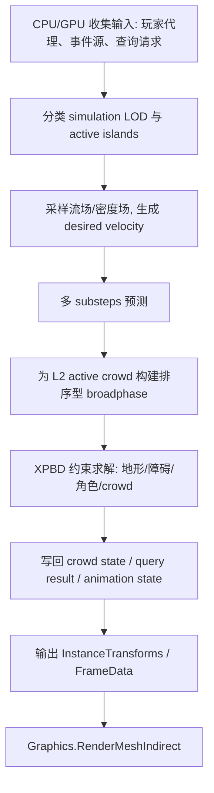

# 千夏大规模人群物理系统技术设计文档

## 文档信息

- 版本：v0.1
- 日期：2026-04-17
- 状态：设计稿
- 适用项目：Unity 6 `6000.0.46f1`、URP
- 作者：Codex
- 上游参考：
  - [现有人群 VAT / Indirect 技术设计](C:/unity/Unity6/docs/plans/qianxia-crowd-vat-technical-design.md)
  - [可乐瓶 PBD 技术设计](C:/unity/Unity6/docs/plans/cola-bottle-pile-collision-technical-design.md)
  - [大规模人群物理系统资料摘要](C:/unity/Unity6/.workspace/artifacts/web/20260417-large-scale-crowd-physics-sources.md)

## 当前假设

由于本轮用户没有补充完整平台和预算，先按当前仓库上下文做以下合理假设：

- 目标平台优先为 PC / 主机级 GPU，而不是中低端移动端
- 目标帧率优先按 `60 FPS` 设计
- 当前 crowd 继续沿用 `LOD2 VAT + Graphics.RenderMeshIndirect + Compute` 渲染主链
- 近场物理系统优先服务“玩家接近、冲散、拥堵、地形贴地、区域查询”等玩法，不追求逐骨骼精确刚体
- v1 不覆盖桥上桥下、楼上楼下这类多层同 `XZ` 空间

## 术语约束

为了避免团队后续误读，本文件中的两个词必须严格区分：

- `Simulation LOD`
  - 指人群的模拟精度分层
  - 决定谁进入 L0 / L1 / L2 / Hero Agent
  - 不等于渲染模型切换
- `Render LOD`
  - 指渲染资源层面的 mesh / material / shader 路径切换
  - 本方案 v1 不新增任何渲染 LOD 分桶
  - 当前仍固定使用单 `LOD2` VAT 资源

## 1. 概述

- 效果目标：在不破坏现有 GPU crowd 渲染规模优势的前提下，引入一套可量产、可分层、可与玩家和玩法交互的大规模 crowd 物理系统
- 核心技术路线：`宏观流场 + 分层 simulation LOD + 近场 2.5D XPBD crowd solver + 统一空间查询 + VAT / Indirect 渲染`
- 与现有系统的关系：
  - 继续复用当前 `CrowdVatIndirectRenderer` 的资源管理、实例缓冲、Terrain 贴地、空间查询和间接绘制链路
  - 升级当前近场 crowd 的 broadphase、约束模型和 simulation LOD
  - 不回退到“逐角色 Animator + SkinnedMeshRenderer + Rigidbody”

## 2. 设计目标

### 2.1 必须解决

- 大规模背景 crowd 的稳定表现
- 玩家/事件源对近场 crowd 的推动和挤压
- crowd-crowd 局部拥堵与互相推开
- Terrain 贴地与静态障碍绕行 / 顶出
- 统一空间查询接口，供 trigger、子弹、检测器、脚本玩法复用
- 规模、交互、调参三者之间的可维护平衡

### 2.2 本版不做

- 全人群逐单位刚体或 CharacterController
- 逐骨骼碰撞、逐帧 ragdoll、逐人动画状态机
- 多层立体空间下的完整 3D crowd broadphase
- 网络锁步级确定性
- 与所有任意 MeshCollider 的精确物理耦合

## 3. 当前项目基线

### 3.1 已有能力

当前项目已经具备以下基础：

- 渲染总控在 [CrowdVatIndirectRenderer.cs](C:/unity/Unity6/Assets/Project/Crowds/VAT/Runtime/CrowdVatIndirectRenderer.cs)
- GPU 更新和 crowd 近场逻辑在 [CrowdVatIndirect.compute](C:/unity/Unity6/Assets/Project/Crowds/VAT/Shader/CrowdVatIndirect.compute)
- 当前每帧已存在：
  - `PredictInstances`
  - `BuildGrid`
  - `SolveCrowdCollisions`
  - `ResolveSpatialQueries`
  - `FinalizeInstances`
- 已有 Terrain 双层贴地：
  - 出生时 CPU 贴地
  - 运行时 GPU 贴地
- 已有 `CharacterController -> interaction sphere` 自动接入
- 已有 `SetSpatialQueries / ReadSpatialQueryResults` 的统一查询入口

### 3.2 当前约束

当前系统的真实边界是：

- 运行时渲染固定只使用 `LOD2`
- crowd 的“物理 shape”本质上仍是 `XZ` 平面上的圆形半径近似
- 近场 crowd solver 还是偏 PBD 风格的位置修正式，尚未升级为 XPBD 参数体系
- broadphase 仍是 fixed-capacity uniform grid，不适合极端密度热点
- 当前 Terrain 碰撞是高度约束，不是完整 3D 静态碰撞体系统

### 3.4 当前真实每帧基线流程

为了避免把“目标方案”误写成“现状”，当前代码里的真实主时序应明确为：

1. `LateUpdate -> UpdateGpuBuffers`
2. `PredictInstances`
3. 每次 solver iteration 执行：
   - `ClearGrid`
   - `BuildGrid`
   - `SolveCrowdCollisions`
4. 若存在 spatial queries：
   - 额外切到 `all-queryables` 网格构建
   - `ClearSpatialQueryResults`
   - `ResolveSpatialQueries`
5. `FinalizeInstances`
6. 相机回调里做可见实例构建和 `Graphics.RenderMeshIndirect`

这部分是现状，不是目标方案假设。

### 3.3 当前项目包约束

从 [manifest.json](C:/unity/Unity6/Packages/manifest.json) 看，项目已有：

- `Burst`
- `Collections`
- `Mathematics`
- `AI Navigation`

但当前没有：

- `Entities`
- `Entities Graphics`

这意味着本轮设计应优先落在现有 `MonoBehaviour + Compute + Buffer + Indirect Draw` 体系中，而不是默认切到完整 ECS 重构。

## 4. 资料收敛结论

### 4.1 broadphase 先行

外部资料和当前瓶堆系统经验都指向同一个结论：

- 先统一空间索引
- 再挂 crowd-crowd、trigger、子弹、检测器和玩法查询

所以本方案不会把每种玩法都各自做一套邻域扫描，而是建立统一的 active-grid 查询基座。

### 4.2 近场物理优先用 XPBD，而不是全量刚体

原因不是“PBD 更学术”，而是它更适合本项目：

- 位置修正稳定
- penetration resolve 直接
- 容易做“推开但别炸散”
- 更容易和现有 crowd 锚点、地形贴地、玩家代理输入结合

### 4.3 多 substeps 比大步长多迭代更适合近场 crowd

本项目的 near crowd 不应走“大步长 + 很多 iteration”的粗暴路线，而应优先：

- 只让 active set 高频更新
- 用更多 substeps
- 每步少量 XPBD 约束投影

### 4.4 需要 simulation LOD，而不是所有人同精度物理

行业经验已经证明，大规模 crowd 一定要把：

- 同屏总人数
- 可交互人数
- 高精度 AI 数量

分开处理。

因此本方案天然是“分层模拟”，不是“全量一刀切 solver”。

## 5. 主方案

## 5.1 总体架构

推荐采用四层结构：

1. 宏观流动层
2. simulation LOD 分层层
3. 近场 crowd 物理层
4. 渲染与查询层

对应关系：

- 宏观流动层：决定人群想往哪里走
- simulation LOD：决定谁要花多少钱来更新
- 近场 crowd 物理层：解决谁和谁挤、谁被谁推、谁该被顶出障碍
- 渲染与查询层：把状态变成可见人群，并提供玩法访问

## 5.2 simulation LOD 分层

### L0：表现层 crowd

- 目标规模：远景和大部分背景 crowd
- 更新方式：
  - 沿流场或样条移动
  - 低频更新
  - 不做 pairwise 接触
- 职责：
  - 填充画面
  - 维持大规模 crowd 的整体流动趋势

### L1：中景 steering crowd

- 目标规模：中景 crowd
- 更新方式：
  - 流场驱动
  - 加密度 / 占用场修正
  - 可选 ORCA-lite 或 velocity obstacle 近似
- 职责：
  - 减少中距离穿插
  - 维持顺滑流动
  - 不承担重接触成本

### L2：近场 physical crowd

- 目标规模：玩家周围、事件中心或镜头焦点附近的 crowd
- 更新方式：
  - 进入 2.5D XPBD solver
  - 参与 crowd-crowd、hero proxy、障碍、边界、贴地等约束
- 职责：
  - 真正表达推挤、拥堵、局部冲散和近场查询

### Hero Agent：高价值 agent

- 数量应严格受控
- 仍可继续走独立 `CharacterController`、`NavMeshAgent` 或脚本逻辑
- 通过代理体和 crowd 系统交互，而不是强行并进 mass crowd solver

## 5.3 物理表示

### 人群个体表示

crowd 个体不使用完整 3D 刚体，而是：

- `XZ` 平面上的圆盘或短胶囊
- 额外带一个高度窗口
- `Y` 通过地形或楼层约束单独求得

这是一种 2.5D 表示。

这样做的原因：

- 对当前项目足够
- 适合大规模
- 能直接沿用当前 crowd 的地形贴地和空间查询语义

### 角色 / 英雄单位表示

近场玩家或高价值单位通过一组 proxy body 注入 crowd 物理层：

- v1 推荐：躯干主代理 + 左右肩代理
- 若玩法需要更强肢体扫开感，再扩展到多 capsule / 多 box

不建议一开始就做“全身十几个代理”，否则 solver 和调参都会明显变重。

### 静态世界表示

静态世界不走逐 agent PhysX 射线，而是拆成两层：

1. 地形高度层
   - 继续使用 `Terrain.SampleHeight` 做出生贴地
   - 继续使用 `TerrainData.heightmapTexture` 做 GPU 每帧贴地
2. 障碍距离层
   - 用 walkable mask、NavMesh 边界、体积障碍或烘焙 SDF 表示“不可进入区域”
   - crowd 通过约束投影或距离场梯度被顶出墙体 / 掩体

## 5.4 约束模型

近场 physical crowd 建议统一成 XPBD 风格的约束集合：

- 地形贴地约束
- 不可行走区域约束
- crowd-crowd 分离约束
- hero proxy 分离约束
- 目标速度 / 流场跟随约束
- 锚点 / 车道回归约束
- 最大位移 / 最大速度约束
- 休眠 / 唤醒约束

约束优先级建议：

1. 地形 / 不可行走区域
2. hero proxy
3. crowd-crowd
4. 流场 / 锚点回归
5. 速度阻尼与最终裁剪

原因：

- 先保证人不会掉出可行走区域
- 再保证玩家 / 事件推动可信
- 然后再做 crowd 间互相挤压
- 最后再把整体运动收回可控状态

## 5.5 broadphase 方案

### 推荐方案

近场 active set 使用排序型 grid broadphase：

- `GridKeyIndexBuffer`
- `CellStartBuffer`
- `CellEndBuffer`
- `OccupiedCellBuffer`
- `ActiveAgentList`

而不是继续只用 fixed-capacity occupant array。

### 为什么升级

当前 fixed-capacity cell 的问题是：

- 调试容易
- 但热点密度一上来就会 overflow
- choke point、冲锋和列阵容易被击穿

排序型 grid 的好处：

- 不需要为每个 cell 预留固定最大容量
- 更适合高密度热点
- 更容易复用给 crowd-crowd、trigger、子弹、检测器和 active wake 查询

### active island

本方案不让全地图所有 L2 crowd 都一直建 grid。

而是：

- 先做 active set 分类
- 再为 active island 建局部 grid
- 非 active crowd 退回 L0/L1

### overflow 策略

本方案明确禁止“静默漏碰撞”。

因此 broadphase / query 的 overflow 策略定义如下：

1. `L2 active set` 超出预算时，不继续硬塞进同一套 solver
   - 优先按距离玩家、事件权重和镜头重要性做降级
   - 超出的 crowd 退回 `L1`
2. 排序型 grid 不再使用“每 cell 固定最大 occupancy”作为主限制
3. 若 cell pair、query hit 或 scratch buffer 达到本帧预算上限：
   - 记录显式 overflow counter
   - 返回调试统计
   - 本帧只允许“有损降级”，不允许“静默丢结果不记账”
4. choke point / 冲锋等热点场景应通过“切 active island”和“扩展邻域预算”处理，而不是继续调大固定 cell 容量

## 5.6 每帧流程

更细的 substep 内顺序建议：

1. 按流场与目标速度预测位置
2. 贴地
3. 约束到可行走区域
4. 处理 hero proxy
5. 处理 crowd-crowd
6. 处理锚点 / 车道回归
7. 更新速度、yaw、动画状态

## 5.7 active set / sleep

active set 是整套系统能否扩量的核心，不是附属优化。

### 激活源

- 玩家主角
- Hero Agent
- 爆炸、冲锋、受惊、技能等事件源
- 高优先级查询请求

### 激活规则

- 在激活半径内的 crowd 进入 `L2`
- 处于 retention 半径内且上一帧已活跃的 crowd 保持 `L2`
- 被 hero proxy、爆炸或 crowd 冲击波推动的 crowd 允许向外一圈传播唤醒

### 退激活规则

- 连续若干帧速度低于阈值
- 不在任意激活源和保活区内
- 最近未收到查询命中、角色接触或高强度 crowd 推挤

### sleep 语义

- `L0/L1` crowd 不是“冻结”，而是降频或切到更便宜的运动模型
- `L2` crowd 也允许进入 sleep，但 sleep 后不再进入近场 pairwise solver
- 重新唤醒时必须保留上一帧状态连续性，避免瞬移和速度跳变

### 默认调度参数建议

| 参数 | 默认值 | 说明 |
|------|--------|------|
| `L2 激活半径` | `14 m` | 与当前 active bubble 基线对齐 |
| `L2 保活半径` | `18 m` | 避免边界抖动 |
| `L2 软上限` | `768` | 超过后开始按优先级降级到 `L1` |
| `L2 硬上限` | `1024` | 超过后禁止继续扩容本帧 solver |
| `睡眠速度阈值` | `0.15 m/s` | 连续低于阈值才进入 sleep 判定 |
| `睡眠判定帧数` | `45` 帧 | 避免短时停顿立刻睡眠 |
| `唤醒传播半径` | `1` 圈邻域 cell | 控制局部冲击传播 |
| `查询全量 rebuild 开关` | `按请求开启` | 仅当 query 明确要求全 queryable 覆盖时触发 |

这些值是设计默认值，不是最终量产值；后续必须通过 benchmark 和 PlayMode 观感验证回归。

## 5.8 导航与宏观流动

本方案明确把“导航”与“物理”分开。

### 宏观层

宏观层建议使用：

- crowd lane graph
- 样条走廊
- 区域流场
- 广场 / choke point 上的动态 potential field

### 为什么不把宏观导航交给近场物理

如果把“想去哪里走”和“被谁推了一下”混在同一层：

- 调参会相互污染
- 挤一下就可能全局漂移
- 难以解释为什么远处 crowd 会突然乱

因此：

- 宏观层给出 desired direction / desired speed
- 近场物理层只负责把它变成“挤得动且不穿模”的结果

### Continuum / ORCA 的位置

- `Continuum / flow field`：更适合 L0/L1
- `ORCA / ClearPath`：更适合 L1，作为速度层 steering
- `XPBD`：更适合 L2，作为接触型 crowd 物理

## 5.9 渲染耦合

渲染层建议继续复用当前 crowd renderer：

- [CrowdVatIndirectRenderer.cs](C:/unity/Unity6/Assets/Project/Crowds/VAT/Runtime/CrowdVatIndirectRenderer.cs)
- [CrowdVatIndirect.compute](C:/unity/Unity6/Assets/Project/Crowds/VAT/Shader/CrowdVatIndirect.compute)
- [CrowdVatIndirectLit.shader](C:/unity/Unity6/Assets/Project/Crowds/VAT/Shader/CrowdVatIndirectLit.shader)

继续保持：

- 单 `LOD2`
- VAT 动画
- `Graphics.RenderMeshIndirect`
- 可见实例 remap buffer

新增的只是：

- 更丰富的 crowd state
- 更稳定的 active set
- 新的 broadphase / solver buffer
- crowd 动画状态标签

### 动画建议

为了让物理效果看起来不只是“脚底滑动”，建议至少准备 crowd 级别的：

- Idle
- Walk
- Jog
- PushReact
- Stagger
- Panic

不需要逐个复杂状态机，但必须有最小的物理反馈动画层。

## 6. 数据设计

## 6.1 静态数据

### CrowdArchetypeAsset

- 视觉 archetype
- VAT 动画集
- 半径、高度、肩宽
- 最大速度、回归强度、阻尼
- 物理 profile

### CrowdFlowFieldAsset

- 区域流向
- 车道 / 走廊定义
- choke point 权重
- faction / 阵营流向

### CrowdObstacleFieldAsset

- walkable mask
- obstacle SDF / occupancy
- 楼层或 crowd volume 标识

## 6.2 运行时 Buffer

### 核心状态

- `SpawnData`
- `AgentState`
- `DesiredVelocity`
- `ActiveMask`
- `SimulationBand`

### broadphase / query

- `GridKeyIndexBuffer`
- `CellStartBuffer`
- `CellEndBuffer`
- `OccupiedCellBuffer`
- `SpatialElementBuffer`
- `SpatialQueryBuffer`
- `SpatialQueryResultBuffer`

## 6.3 查询契约

对外查询接口建议继续兼容当前 `SetSpatialQueries / ReadSpatialQueryResults` 语义，但补齐以下明确约束：

- 支持的 query shape：
  - `OverlapSphere`
  - `SweepCapsule`
  - 后续可扩展 `Cone` 或 `BoxSweep`
- 过滤维度：
  - `factionMask`
  - `targetMask`
  - `activeOnly`
- 返回语义：
  - `totalHits`
  - `writtenHits`
  - `overflow`
  - `normalizedDistance`
- 契约原则：
  - query pass 只返回结果，不直接改 crowd 状态
  - overflow 必须可见、可统计、可调试
  - gameplay 层不能把“没写回 hit”误判为“完全没命中”

### 查询覆盖语义

这里需要和当前实现保持兼容：

1. 默认查询覆盖范围是 `all queryables`
   - 即使对象当前不在 `L2 active set`
   - 只要它仍然是可查询 crowd 元素，就应能被命中
2. 只有请求显式带 `activeOnly` 时，才允许只查 active crowd
3. 因此查询层允许拥有一条独立于 `L2 physics grid` 的轻量 query build 路径
4. 不允许把“active island 局部建 grid”直接偷换成“全局查询也只查 active island”

## 6.4 Terrain / 静态几何覆盖范围

v1 对静态世界的覆盖范围必须写死，不允许语义漂移：

- 支持：
  - Terrain 高度贴地
  - 基于 obstacle field 的墙体、掩体、边界顶出
  - 基于 walkable mask 的不可进入区限制
- 不支持：
  - 任意复杂 MeshCollider 的完整 3D 逐面碰撞
  - 同 `XZ` 多层 walkable 面
  - 需要精确高度层判断的桥洞、楼中楼

如果关卡需要上下层重叠 crowd，必须升级为：

- crowd volume 分层
- 或真正 3D broadphase

### 物理求解

- `ConstraintScratchBuffer`
- `ProxyBodyBuffer`
- `ObstacleFieldTexture`
- `TerrainHeightTexture`

### 渲染输出

- `_InstanceTransforms`
- `_InstanceFrameData`
- `_VisibleInstanceIndices`

## 7. 性能预算

以下是设计目标预算，不是已实测结果：

| 模块 | 目标预算 | 备注 |
|------|----------|------|
| CPU 调度与上传 | `0.4 - 1.2 ms` | 只上传活跃 proxy、查询与少量控制数据 |
| L0/L1 crowd 更新 | `0.4 - 1.0 ms` | 低频或稀疏更新 |
| L2 broadphase | `0.6 - 1.5 ms` | 仅 active island |
| L2 XPBD solver | `1.5 - 3.5 ms` | 与 active 数量、substeps 成正相关 |
| 查询与结果整理 | `0.1 - 0.5 ms` | 优先留在 GPU，减少同步 |
| Indirect 提交 CPU | `0.1 - 0.4 ms` | chunk / visible list 组织 |
| VAT 渲染 GPU | `2.0 - 6.0 ms` | 视可见数量、阴影和 overdraw 而定 |

建议的数量级目标：

- 同屏 crowd：`10k - 50k`
- L1 steering crowd：`2k - 8k`
- L2 physical crowd：`300 - 1500`
- Hero Agents：`20 - 80`

## 7.1 物理真实度边界

这套系统追求的不是“刚体级真实”，而是：

- 看起来有重量和拥挤感
- 玩家冲入时局部会被推开
- crowd 不会明显穿插、穿地、穿墙
- 大规模下仍然稳定

这套系统不承诺：

- 逐个 agent 的严格动量守恒
- 逐骨骼命中一致性
- 和 PhysX 刚体世界的完全对等交互
- 多平台逐帧确定性

## 8. 方案对比

## 8.1 不选“全量逐人刚体”

原因：

- 和当前 GPU crowd 渲染路线冲突
- CPU 预算不可控
- 工程复杂度和动画耦合成本过高

## 8.2 不选“纯 ORCA / ClearPath”

原因：

- 它们擅长无碰撞导航
- 不擅长表达接触型推挤、冲散和局部拥堵压力
- 玩家冲入 crowd 后会更像“自动绕开”，而不是“被挤开”

## 8.3 不选“纯 Continuum / 密度场”

原因：

- 宏观流动很好
- 但不适合承接近场角色交互和命中查询
- 缺乏个体接触表达

## 8.4 不选“全量 3D crowd 刚体粒子”

原因：

- 当前项目不需要完整三维人群翻滚和立体堆叠
- 楼层、桥、上下空间等问题会显著抬高复杂度
- 成本和收益不匹配

## 9. 实施路线

## 9.0 迁移矩阵

| Phase | 新增/替换 | 保留接口 | 放行标准 |
|------|-----------|----------|----------|
| Phase 1 | `active sorted grid`、XPBD 约束、overflow 统计 | `LOD2 VAT`、`RenderMeshIndirect`、`SetSpatialQueries/ReadSpatialQueryResults` | terrain、active bubble、query、culling 现有测试不回归 |
| Phase 2 | `SimulationBand`、`DesiredVelocity`、wake/sleep | 现有渲染输出 buffer 契约不变 | `L0/L1/L2` 切换稳定，sleep/wake 无明显边界抖动 |
| Phase 3 | lane graph、flow field、density field | 近场 XPBD 与 query 契约不变 | choke point、大广场流动和事件疏散样机通过 |
| Phase 4 | hero agent 桥接、玩法查询扩展 | 现有 indirect draw 和基础 crowd renderer 保持兼容 | 子弹/trigger/检测器接入且性能预算可控 |

## 9.1 Phase 1：把当前 crowd 从“近似碰撞”升级到“可量产近场物理”

- 保留当前 renderer 和 VAT 资源链
- broadphase 从 fixed-capacity grid 升级到 active sorted grid
- crowd-crowd / hero / obstacle 约束统一升级到 XPBD 参数体系
- 每帧求解改为 `多 substeps + 少 iteration`
- 引入 obstacle field authoring
- 引入更完整的调试统计：
  - active 数量
  - occupied cell 数量
  - 最热 cell
  - 约束次数
  - 平均位移

## 9.2 Phase 2：引入 simulation LOD

- 区分 L0 / L1 / L2
- 引入 active island compaction
- 引入 wake / sleep
- 中景 crowd 接入 density field 或 ORCA-lite

## 9.3 Phase 3：引入宏观流场

- lane graph
- 区域流场
- choke point 拥堵疏导
- 事件驱动 crowd 波及

## 9.4 Phase 4：玩法整合

- 子弹 / trigger / 检测器统一走查询层
- 高价值 NPC 走 Hero Agent 路线
- crowd 状态驱动动画层增强

## 9.5 验证计划

至少要覆盖以下验证，不允许只看主观观感：

### 功能回归

- Terrain 贴地
- active bubble 生效
- query 结果正确
- 可见实例剔除与 indirect 提交正确
- `LOD2` 单路线资源兼容

### 稳定性

- choke point 高密度
- 玩家冲入前排
- 长时间运行后的 sleep / wake 抖动
- overflow 统计是否被正确记录

### 性能

- `L0/L1/L2` 各自人数和总帧耗时
- broadphase、solver、query 的分项时间
- CPU 可见索引构建与 `SetData` 开销

### 建议复用的现有测试入口

- [CrowdVatIndirectTerrainCollisionTests.cs](C:/unity/Unity6/Assets/Tests/PlayMode/CrowdVatIndirectTerrainCollisionTests.cs)
- [CrowdVatIndirectSpatialQueryTests.cs](C:/unity/Unity6/Assets/Tests/PlayMode/CrowdVatIndirectSpatialQueryTests.cs)
- [CrowdVatIndirectActiveBubbleTests.cs](C:/unity/Unity6/Assets/Tests/PlayMode/CrowdVatIndirectActiveBubbleTests.cs)
- [CrowdVatIndirectRenderCullingTests.cs](C:/unity/Unity6/Assets/Tests/PlayMode/CrowdVatIndirectRenderCullingTests.cs)

## 10. 主动挑战与压力测试

下面这些问题必须在样机阶段正面回答：

### 场景 1：狭窄 choke point

- 两侧墙体之间只能过 `2-3` 人宽
- 大量 crowd 同时汇入
- 是否出现热点 cell 爆炸、穿墙或来回抖动

### 场景 2：玩家高速冲入前排 crowd

- 玩家冲刺进入近场 dense crowd
- 是否出现“前排被推开、后排完全不动”的假感
- 冲击是否能形成局部传播，但不会把整片 crowd 一次性炸散

### 场景 3：高处俯视大广场

- 镜头里同时出现大规模 crowd
- 是否只有近场才进重 solver
- 远景是否还能保持平滑整体流动

### 场景 4：斜坡和边缘

- crowd 被推到坡地、台阶边缘或 cliff 附近
- 是否稳定贴地
- 是否会被推入不可行走区

### 场景 5：上下层重叠空间

- 桥上桥下、楼上楼下共享同 `XZ`
- 当前 2.5D 语义是否失效
- 如果失效，是否必须引入 crowd volume 分层

## 11. 已知风险与未解决问题

### 待决策

- [ ] v1 是否只支持单层 outdoor crowd volume
- [ ] hero proxy 是单代理、三代理还是多肢体代理
- [ ] L1 是否需要 ORCA-lite，还是先只用 density gradient
- [ ] obstacle field 采用 SDF 还是 occupancy + normal 近似
- [ ] CPU 侧可见实例 remap 是否要在后续升级到 GPU driven culling

### 已知风险

- 如果关卡后续大量使用桥梁、室内多层、楼梯井，2.5D crowd 物理需要升级
- 如果玩法要求强 determinism，本方案需要单独设计同步策略
- 如果仍沿用当前单一 walk 动画，物理反馈会显得“滑”
- 如果 active set 规模控制不好，near crowd 成本会快速失控
- 如果 query 长期开启且走全 queryable grid rebuild，active bubble 的收益会被明显吞掉
- 如果仓库入口文档继续引用不存在的 `docs/*.md`，团队后续会对当前真实设计入口产生误判

### 暂时搁置

- crowd ragdoll
- 逐肢体精确碰撞
- 完整室内多层 crowd
- 网络锁步级 crowd 复制

## 12. 结论

对当前 Unity 6 项目而言，最合适的大规模 crowd 物理系统不是：

- 全量刚体
- 纯导航
- 纯流场
- 纯 ORCA

而是：

`宏观流场 + simulation LOD + 近场 2.5D XPBD crowd solver + 统一空间查询 + 现有 VAT/Indirect 渲染`

这条路线和当前仓库已有资产、已有 crowd 代码、本地 PBD 经验以及外部资料结论是最一致的，也最有机会在不推翻现有 renderer 的前提下，真正做出“量大、能推、能查、能落地”的 crowd 系统。

## 13. 参考资料

### 本地文档

- [现有人群 VAT / Indirect 技术设计](C:/unity/Unity6/docs/plans/qianxia-crowd-vat-technical-design.md)
- [可乐瓶 PBD 技术设计](C:/unity/Unity6/docs/plans/cola-bottle-pile-collision-technical-design.md)
- [大规模人群物理系统资料摘要](C:/unity/Unity6/.workspace/artifacts/web/20260417-large-scale-crowd-physics-sources.md)

### 外部资料

- [GPU Gems 3 Broad Phase](https://developer.nvidia.com/gpugems/gpugems3/part-v-physics-simulation/chapter-32-broad-phase-collision-detection-cuda)
- [Position Based Dynamics](https://matthias-research.github.io/pages/publications/posBasedDyn.pdf)
- [XPBD](https://matthias-research.github.io/pages/publications/XPBD.pdf)
- [Small Steps in Physics Simulation](https://mmacklin.com/smallsteps.pdf)
- [ORCA](https://gamma-web.iacs.umd.edu/ORCA/)
- [ClearPath](https://diglib.eg.org/items/bdfea054-b571-4b5a-a44c-38b47876604f)
- [Continuum Crowds](https://grail.cs.washington.edu/projects/continuum-crowds/continuum-crowds.pdf)
- [AC Unity Crowd AI Recycling](https://www.gdcvault.com/play/1022411/massive-crowd-on-assassin-s)
- [Unity Graphics.RenderMeshIndirect](https://docs.unity.cn/ScriptReference/Graphics.RenderMeshIndirect.html)
- [Unity GraphicsBuffer.Target.Structured](https://docs.unity3d.com/kr/2022.3/ScriptReference/GraphicsBuffer.Target.Structured.html)
- [Unity Terrain.SampleHeight](https://docs.unity3d.com/ScriptReference/Terrain.SampleHeight.html)
- [Unity TerrainData.heightmapTexture](https://docs.unity3d.com/ScriptReference/TerrainData-heightmapTexture.html)
