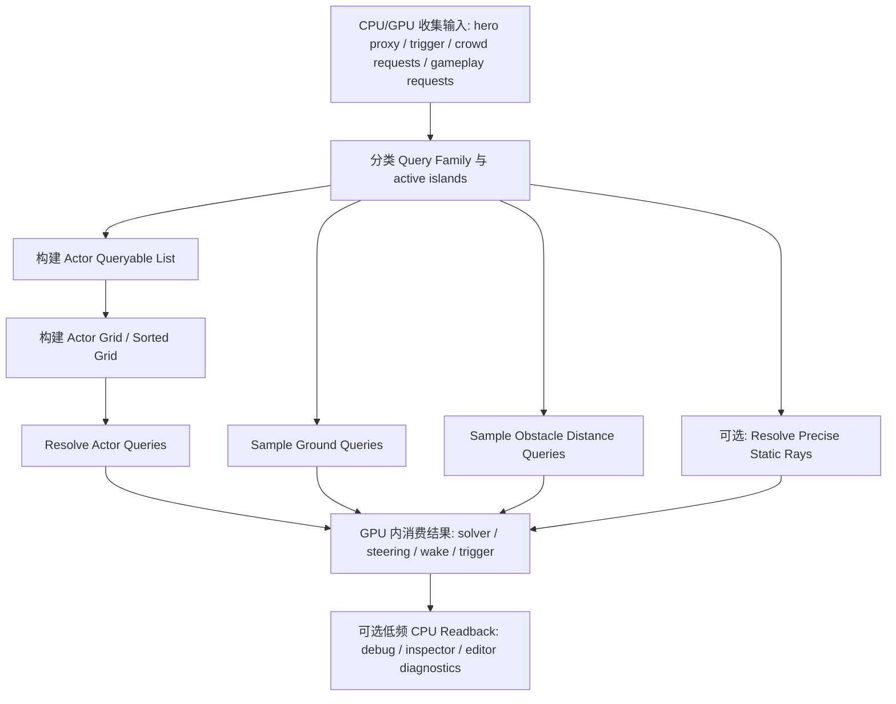

# 千夏 Scene Query 技术设计文档

## 文档信息

- 版本：v0.1
- 日期：2026-04-18
- 状态：设计稿
- 适用项目：Unity 6 `6000.0.46f1`、URP `17.0.4`
- 作者：Codex
- 上游参考：
  - [千夏 Crowd VAT / Indirect 技术设计文档](C:/unity/Unity6/docs/plans/qianxia-crowd-vat-technical-design.md)
  - [千夏大规模人群物理系统技术设计文档](C:/unity/Unity6/docs/plans/qianxia-large-scale-crowd-physics-design.md)
  - [Scene Query 外部资料研究摘要](C:/unity/Unity6/.workspace/artifacts/web/20260418-scene-query-research.md)

## 变更记录

| 版本 | 日期 | 变更内容 |
|------|------|----------|
| v0.1 | 2026-04-18 | 基于现有 crowd query 实现、已有设计稿与外部资料，建立 Scene Query 第一版技术设计稿。 |

## 当前假设

由于本轮用户没有补充完整平台与预算，本设计先按当前仓库上下文做以下合理假设：

- 目标平台优先为 `PC / 主机级 GPU`
- 目标帧率优先按 `60 FPS` 设计
- 当前项目继续沿用 `MonoBehaviour + Compute + Buffer + VAT + RenderMeshIndirect`
- 当前主要场景仍是 `单层 outdoor crowd`
- v1 的 Scene Query 主要服务：
  - crowd 局部交互
  - hero / trigger / detector 查询
  - terrain / obstacle 约束
  - 小规模高价值玩法查询
- v1 不覆盖桥上桥下、楼上楼下等同 `XZ` 多层重叠空间

如果后续平台、地图结构或玩法密度改变，本文需要升级到 v0.2。

## 1. 概述

- 效果目标：把当前 crowd-only 的 `Spatial Query` 升级为可供 crowd 物理、steering、trigger、hero proxy 和玩法脚本复用的统一 `Scene Query` 系统。
- 核心技术路线：`分层 Scene Query 契约 + Actor Sorted Grid + Terrain/Walkable Height Layer + Static Obstacle SDF + 可选 Precise Ray BVH`
- 与现有系统的关系：
  - 保留 [CrowdVatIndirectRenderer.cs](C:/unity/Unity6/Assets/Project/Crowds/VAT/Runtime/CrowdVatIndirectRenderer.cs) 作为 v1 Scene Query 运行时宿主
  - 保留 [CrowdVatIndirect.compute](C:/unity/Unity6/Assets/Project/Crowds/VAT/Shader/CrowdVatIndirect.compute) 作为 v1 的主 query / solver compute
  - 继续兼容 [CrowdVatSpatialQueryTypes.cs](C:/unity/Unity6/Assets/Project/Crowds/VAT/Runtime/CrowdVatSpatialQueryTypes.cs) 的 actor query 语义
  - 把当前 `Terrain + static SDF` 从“近场碰撞输入”升级为“Scene Query 静态世界层”

## 2. 外部资料可用点分析

本节用于回答“你给的外部资料里，哪些内容真正适合当前项目”。

### 2.1 可直接复用

- `范围查询 -> Uniform Grid`
  - 完全适合当前 crowd actor query
  - 现有 `OverlapSphere / SweepCapsule` 已在走这条路
- `距离查询 -> SDF Texture`
  - 非常适合当前静态障碍、边界推出、最近表面方向
  - 当前仓库已有 `static SDF` 接口，可直接扩展
- `GPU 树遍历改显式栈`
  - 适合后续静态障碍精确 raycast / closest-point
- `全程尽量 GPU 内消费结果`
  - 这条原则应成为 Scene Query 的默认语义

### 2.2 需要改造后复用

- `Raycast -> BVH`
  - 方向是对的
  - 但当前项目不应一上来就把全部 Scene Query 都迁到 LBVH
  - 更合理的是把 LBVH 放到：
    - 静态遮挡精确 raycast
    - line-of-sight
    - projectile obstruction
    - closest-point
- `Shape Query -> GJK / SAT`
  - 方向是对的
  - 但 v1 只适合少量高价值 convex proxy
  - 不适合作为 crowd scene query 的基础窄相
- `统一 Scene Query Pass 架构`
  - 可以复用“Build AS -> Broad Phase -> Narrow Phase -> Result Consume”的思想
  - 但实现上应拆成多类 query family，而不是所有请求都共用一个 union 结构

### 2.3 当前阶段不应直接采用

- 全场景逐帧重建精确静态三角形 LBVH
- 把所有 crowd-vs-scene 基础交互都升级成凸体窄相
- 默认每帧同步 GPU 结果回读 CPU
- 把 active island 局部优化偷换成全局查询覆盖范围

### 2.4 本项目最终结论

当前项目最合理的 Scene Query 不是单结构，而是混合结构：

- `Actor Query`：Sorted Grid
- `Ground Query`：Terrain / Height / Walkable Mask
- `Obstacle Distance Query`：Static SDF
- `Precise Ray Query`：可选 LBVH
- `Convex Shape Query`：只用于 hero proxy / 高价值动态体

## 3. 本版范围

### 3.1 本版必须解决

- 保留并扩展当前 actor query 语义
- 给 crowd solver 和 steering 提供统一的静态世界查询接口
- 建立明确的 Scene Query 契约与覆盖语义
- 明确 CPU / GPU 两条消费路径
- 为后续小队、trigger、子弹和检测器留下稳定入口

### 3.2 本版不做

- 完整全局三角形级 GPU ray tracing 管线
- 多层 crowd volume 下的完整 3D Scene Query
- Skeletal Mesh 级动态距离场更新
- 所有 dynamic obstacle 的实时凸分解
- ECS / DOTS 重构

## 4. 当前项目基线

### 4.1 已有能力

当前项目已经具备以下 Scene Query 基础：

- [CrowdVatSpatialQueryTypes.cs](C:/unity/Unity6/Assets/Project/Crowds/VAT/Runtime/CrowdVatSpatialQueryTypes.cs)
  - 已定义：
    - `CrowdVatSpatialQueryRequest`
    - `CrowdVatSpatialQueryResult`
    - `CrowdVatSpatialQueryHit`
    - `OverlapSphere / SweepCapsule`
    - `ActiveOnly`
    - `FactionMask / TargetMask`
- [CrowdVatIndirectRenderer.cs](C:/unity/Unity6/Assets/Project/Crowds/VAT/Runtime/CrowdVatIndirectRenderer.cs)
  - 已提供：
    - `SetSpatialQueries(...)`
    - `ClearSpatialQueries()`
    - `ReadSpatialQueryResults(...)`
  - 已支持：
    - `GridBuildModeAllQueryables`
    - `Terrain heightmap`
    - `static SDF`
- [CrowdVatIndirect.compute](C:/unity/Unity6/Assets/Project/Crowds/VAT/Shader/CrowdVatIndirect.compute)
  - 已存在：
    - `BuildGrid`
    - `ResolveSpatialQueries`
    - capsule element 表示
    - query hit/result buffer 写回

### 4.2 已有测试覆盖

当前 [CrowdVatIndirectSpatialQueryTests.cs](C:/unity/Unity6/Assets/Tests/PlayMode/CrowdVatIndirectSpatialQueryTests.cs) 已覆盖：

- `OverlapSphere` 命中附近 crowd
- `SweepCapsule` 命中顺序正确
- `ActiveOnly` 过滤非 active crowd
- `FactionMask` 阵营过滤
- capsule 高度窗口命中行为

这说明当前 `Actor Query` 契约已经具备可验证基础，不应推翻重写。

### 4.3 当前真实问题

当前系统离完整 Scene Query 还差以下几层：

- 只覆盖 `CrowdAgent`，未覆盖：
  - hero proxy
  - trigger
  - 动态 obstacle
  - query sensor
- `Terrain` 与 `static SDF` 只作为 solver 输入，没有作为统一 Scene Query 服务暴露
- CPU 侧仍容易把 `ReadSpatialQueryResults()` 当成常驻玩法接口
- broadphase 仍是 `fixed-capacity grid`
- 还没有静态精确 ray query 的可选后路

## 5. Scene Query 总体方案

### 5.1 总体架构

推荐采用四层 Scene Query 结构：

1. `Actor Query Layer`
2. `Ground Query Layer`
3. `Obstacle Distance Layer`
4. `Precise Static Ray Layer`

它们的职责分别是：

- `Actor Query Layer`
  - 查询 crowd、hero proxy、trigger、动态 obstacle
  - 解决“附近有哪些动态可交互目标”
- `Ground Query Layer`
  - 查询地面高度、法线、可行走性
  - 解决“脚下能不能站、该回到哪里”
- `Obstacle Distance Layer`
  - 查询最近静态障碍距离与梯度
  - 解决“离墙多远、往哪推开、边界在哪”
- `Precise Static Ray Layer`
  - 解决高价值静态 ray / LOS / projectile obstruction
  - 不是 v1 主负载

### 5.2 设计原则

- 一个查询类型用最合适的数据结构，不强求统一底层
- 查询覆盖范围必须独立于 active island 优化
- GPU 结果默认在 GPU 内消费，CPU 回读是例外路径
- 静态世界优先用 field representation，不优先用 PhysX
- v1 优先保证：
  - 契约清晰
  - 覆盖稳定
  - overflow 可见
  - 调试可视化

## 6. 查询契约设计

### 6.1 查询家族

v1 不建议把所有 Scene Query 都塞进一个请求结构，而是拆成四类：

#### A. Actor Query

- 查询对象：
  - crowd agent
  - hero proxy
  - dynamic obstacle
  - trigger / sensor
- 支持形状：
  - `OverlapSphere`
  - `SweepCapsule`
  - Phase 2 可扩展 `BoxOverlap`
- 返回：
  - `queryId`
  - `totalHits`
  - `writtenHits`
  - `overflow`
  - `normalizedDistance`
  - `targetMask`
  - `flags`
  - `faction`

#### B. Ground Query

- 查询对象：
  - terrain
  - walkable mask
- 查询形式：
  - `SampleHeight`
  - `SampleNormal`
  - `CheckWalkable`
- 返回：
  - `height`
  - `normal`
  - `walkable`
  - `surfaceFlags`

#### C. Obstacle Distance Query

- 查询对象：
  - static SDF
  - obstacle field
- 查询形式：
  - `SampleSignedDistance`
  - `SampleGradient`
  - `CheckInsideObstacle`
- 返回：
  - `signedDistance`
  - `gradient`
  - `inside`
  - `sourceFlags`

#### D. Precise Static Ray Query

- 查询对象：
  - 高价值静态障碍代理
  - 后续可扩展为静态场景精确碰撞代理
- 查询形式：
  - `Raycast`
  - `ClosestPoint`
- 返回：
  - `hit`
  - `distance`
  - `position`
  - `normal`
  - `objectId`

### 6.2 查询覆盖语义

本节必须和现有设计稿保持一致：

1. 默认查询覆盖 `all queryables`
2. 只有显式带 `activeOnly` 时，才允许只查 active crowd
3. 不允许把“active island 局部建 grid”偷换成“全局 Scene Query 只查 active island”
4. gameplay 层不能把“没写回 hit”误判为“完全没命中”

### 6.3 CPU / GPU 消费语义

Scene Query 结果分两条消费路径：

#### GPU 常驻路径

- crowd solver
- steering
- wake / sleep
- density / congestion
- trigger prefilter

特点：

- 默认路径
- 不回读 CPU
- 延迟最低

#### CPU 低频路径

- 调试可视化
- 编辑器诊断
- 少量脚本玩法确认
- 低频 AI 决策

特点：

- 默认低频
- 建议异步读回
- 不得变成每帧常驻玩法主通路

## 7. 数据结构与存储

### 7.1 Actor Query 数据

#### v1

- `SpatialElementBuffer`
- `GridCounterBuffer`
- `GridOccupantBuffer`
- `SpatialQueryBuffer`
- `SpatialQueryResultBuffer`
- `SpatialQueryHitBuffer`

这部分继续兼容现有实现。

#### Phase 2 升级

把 `fixed-capacity grid` 升级为排序型 grid：

- `ActorGridKeyIndexBuffer`
- `ActorCellStartBuffer`
- `ActorCellEndBuffer`
- `ActorSortedIndexBuffer`
- `ActiveActorListBuffer`

升级理由：

- 热点密度更稳
- 不再依赖单 cell 固定 occupancy
- 更适合 choke point / 冲锋 / 挤压传播

### 7.2 Ground Query 数据

- `TerrainHeightTexture`
- `TerrainNormalTexture` 或由高度导数推导
- `WalkableMaskTexture`
- `GroundFlagsTexture`

当前项目已有 `Terrain heightmap` 基础，v1 先不额外引入复杂体素结构。

### 7.3 Obstacle Distance 数据

- `StaticObstacleSdfTexture`
- `StaticObstacleSdfWorldBounds`
- `StaticObstacleFlags`

v1 先沿用当前单 volume `static SDF` 语义。

Phase 2 可扩展：

- clipmap / tiled global field
- 多 volume 分块
- 近表面 object field + 远距离 global field 混合

### 7.4 Precise Ray 数据

仅在需要时引入：

- `StaticRayBvhNodeBuffer`
- `StaticRayLeafBuffer`
- `RayQueryBuffer`
- `RayQueryResultBuffer`

v1 不要求完整三角形级场景精确 BVH。

## 8. 核心算法与技术选型

### 8.1 Actor Query：排序型 Grid，而不是全量 BVH

#### 选择理由

- 适合：
  - 局部范围查询
  - 尺度相近的 crowd / proxy / trigger
  - 固定形状 overlap / sweep
- 和当前系统最兼容
- 更容易服务：
  - crowd-crowd
  - trigger
  - detector
  - wake propagation

#### 备选方案

- `LBVH`
  - 排除理由：
    - 对当前主查询类型不是最优
    - 实现复杂度高于收益
    - divergence 风险更高

### 8.2 Ground Query：高度图 + 可行走遮罩

#### 选择理由

- 当前项目已有 terrain
- 直接服务：
  - 贴地
  - ground probe
  - walkable 约束
- 远低于逐 agent PhysX 射线成本

#### 备选方案

- 全量 PhysX 地面射线
  - 排除理由：
    - 破坏 GPU 驱动主链
    - 无法扩展到大规模 crowd

### 8.3 Obstacle Distance Query：SDF，而不是 MeshCollider 精确查询

#### 选择理由

- 查询快
- 同时给出距离和梯度
- 非常适合：
  - 推开
  - 贴边
  - 边界约束
  - obstacle avoidance

#### 备选方案

- 每帧 MeshCollider / triangle precise query
  - 排除理由：
    - 对当前 crowd 交互过重
    - 不适合常驻路径

### 8.4 Precise Static Ray：LBVH 作为可选后路

#### 选择理由

- 对 ray / closest-point 这类树形剪枝查询，BVH 明显更合适
- 后续 line-of-sight、projectile obstruction 会需要更精确遮挡

#### 当前不作为主线理由

- 当前 crowd query 的主负载不是 raycast
- 静态三角形级资产抽取、扁平节点构建与 Unity 侧数据同步成本较高
- 先补契约与 field layer 更划算

### 8.5 Convex Shape Query：只给少量高价值对象

#### 选择理由

- hero proxy、少量动态障碍值得更精确
- 可与 `Actor Query` 的 broad phase 配合

#### 当前不扩到全系统理由

- crowd 主表示仍是 2.5D capsule / disk
- 全量 convex narrow phase 会显著抬高成本与复杂度

## 9. 每帧执行流程

### 9.1 v1 最小落地顺序

1. 保持当前 actor query buffer 与接口
2. 把 `Terrain / static SDF` 升级为 Scene Query 的静态层语义
3. 增加 `Ground Query / Obstacle Distance Query` 契约
4. 默认结果 GPU 内消费
5. 保留 CPU 读回仅作调试

### 9.2 Phase 2

1. Actor grid 升级为排序型 grid
2. 引入 hero proxy / dynamic obstacle queryable target
3. 增加 query overflow 统计与可视化
4. 必要时再补 static ray LBVH

## 10. 关卡与 TA 工作流

### 10.1 关卡输入资产

v1 需要以下关卡输入：

- Terrain 高度图
- walkable mask
- static obstacle SDF
- 可选 hero proxy / trigger / dynamic obstacle authoring

### 10.2 推荐资产组织

建议新增一类 authoring 资产：

- `CrowdSceneQueryFieldAsset`

建议包含：

- terrain 绑定
- walkable mask
- static SDF 贴图
- world bounds
- 调试参数

### 10.3 调试可视化

需要至少提供：

- actor grid 范围
- query shape gizmo
- query overflow 统计
- ground / walkable 采样显示
- obstacle distance / gradient 可视化
- active island 范围

## 11. 性能预算

以下是 v1 设计目标预算，不是已实测结果：

| 模块 | 目标预算 | 备注 |
|------|----------|------|
| CPU 调度与上传 | `0.2 - 0.6 ms` | 仅 query request、少量 proxy 和调试参数 |
| Actor Grid Build | `0.4 - 1.2 ms` | 视 `all queryables` 数量而定 |
| Actor Query Resolve | `0.2 - 0.8 ms` | 以局部 overlap / sweep 为主 |
| Ground / Walkable Sample | `0.05 - 0.2 ms` | 主要是纹理采样 |
| Obstacle Distance Sample | `0.1 - 0.3 ms` | 主要是 SDF 采样与梯度 |
| 可选 Precise Ray Query | `0.0 - 0.8 ms` | 默认关闭，按需求启用 |
| GPU -> CPU Readback | 默认 `0 ms` | 非调试路径禁止常驻 |
| Query 内存占用 | `16 - 64 MB` | 视 grid、field、optional BVH 而定 |

### 11.1 规模假设

v1 先按以下规模设计：

| 项目 | 目标规模 | 备注 |
|------|----------|------|
| 总同屏 crowd | `10k - 50k` | 继续服务规模感 |
| 可查询 actor | `1k - 6k` | 含 active crowd、proxy、trigger |
| 高频 actor query | `32 - 256` | 常驻 steering / trigger / hero |
| 低频 CPU query | `<= 32` | 调试、诊断、少量脚本玩法 |

## 12. 已知风险与未解决问题

### 待决策

- [ ] v1 是否需要把 `Ground Query` 暴露成单独 CPU API，还是先只供 GPU solver 内部使用
- [ ] `static SDF` 是继续单 volume，还是进入 clipmap / tiled field
- [ ] `Precise Ray Query` 是 v2 才接，还是为小队 line-of-sight 提前开最小版本

### 已知风险

- `fixed-capacity grid` 在 choke point / 冲锋 / 热点挤压下会 overflow
- `static SDF` 对大物体、薄结构和近表面细节精度有限
- 多层 walkable 空间会直接击穿当前 2.5D 语义
- 若 gameplay 大量依赖同步 `Readback`，会把 Scene Query 重新拖回 CPU 瓶颈
- 若把 actor query 与 active island 语义混用，容易出现“查不到不等于不存在”的伪 bug

### 暂时搁置

- 完整动态障碍距离场实时更新
- Skeletal Mesh 参与 Scene Query 距离场
- 多层楼体 / 桥梁 crowd volume
- 全场景精确三角形 ray tracing

## 13. 里程碑

- [ ] Phase 1：Scene Query 契约与静态世界层
  - 目标：保留现有 actor query，补 Ground / Obstacle Distance 语义
- [ ] Phase 2：Actor Sorted Grid
  - 目标：替换 `fixed-capacity` broad phase，提升热点鲁棒性
- [ ] Phase 3：高价值动态体与 hero proxy
  - 目标：把 queryable actor 从 `CrowdAgent` 扩展到更完整目标集
- [ ] Phase 4：Precise Static Ray
  - 目标：仅在确实需要精确静态遮挡时接入 LBVH
- [ ] Phase 5：压力测试与调试工具
  - 目标：把 query overflow、field 精度和 active island 行为可视化

## 附录 A：主动挑战清单

以下问题是本设计必须经受的压力测试，不可跳过。

### A.1 压力场景测试

1. 玩家从密集 crowd 前排高速冲入，`Actor Query + SDF` 能否让局部推开自然传播，而不是只在脚边开洞？
2. 一条狭窄巷道同时发生小队推进、hero proxy 推挤和 trigger 检测时，排序型 grid 预算是否足够？overflow 如何暴露？
3. 镜头从地面快速切到高空俯视时，`all queryables` 语义是否仍然成立，而不会被 active island 缩窄？
4. 若场景里有大体量墙体或建筑整块烘进同一个 SDF volume，近表面梯度是否仍足够稳定？
5. 当关卡开始出现桥梁、楼梯井和重叠走廊时，当前 2.5D Scene Query 会在哪些地方先失效？

### A.2 暴露未考虑的约束

- Scene Query 是否需要回放一致性或网络同步语义？
- 动态 obstacle 的生命周期如何接入 queryable set？
- query result 是否允许跨帧复用，还是必须每帧重算？
- 若玩法开始依赖 line-of-sight，SDF raymarch 的误差是否可接受？
- Terrain 之外的不可行走区域由谁 authoring：mask、SDF、还是凸代理？

### A.3 对标行业已有方案

- 类似 Unreal Distance Field 的方案已经证明：
  - 距离场适合静态世界中长距离影响
  - 但近表面精度和大物体分辨率是硬约束
- 类似 GPU broad phase / spatial hashing 的方案已经证明：
  - Actor Query 的第一收益点在 broad phase
  - 不是在一开始就追求最复杂窄相
- 类似 LBVH 的方案已经证明：
  - 树形查询可以 GPU 化
  - 但真正的瓶颈常常是 divergence，而不是“有没有递归”

## 14. 参考资料

- Tero Karras, *Maximizing Parallelism in the Construction of BVHs, Octrees, and k-d Trees*  
  https://research.nvidia.com/publication/2012-06_maximizing-parallelism-construction-bvhs-octrees-and-k-d-trees
- Christian Lauterbach et al., *Fast BVH Construction on GPUs*  
  https://research.nvidia.com/publication/2009-03_fast-bvh-construction-gpus
- Scott Le Grand, *GPU Gems 3 Chapter 32: Broad-Phase Collision Detection with CUDA*  
  https://developer.nvidia.com/gpugems/gpugems3/part-v-physics-simulation/chapter-32-broad-phase-collision-detection-cuda
- Erwin Coumans, *GPU Gems 3 Chapter 33: LCP Algorithms for Collision Detection Using CUDA*  
  https://developer.nvidia.com/gpugems/gpugems3/part-v-physics-simulation/chapter-33-lcp-algorithms-collision-detection-using-cuda
- Tero Karras, *Thinking Parallel, Part II: Tree Traversal on the GPU*  
  https://developer.nvidia.com/blog/thinking-parallel-part-ii-tree-traversal-gpu/
- Matthias Teschner et al., *Optimized Spatial Hashing for Collision Detection of Deformable Objects*  
  https://matthias-research.github.io/pages/publications/tetraederCollision.pdf
- Epic Developer Community, *Distance Field Ambient Occlusion in Unreal Engine*  
  https://dev.epicgames.com/documentation/en-us/unreal-engine/distance-field-ambient-occlusion-in-unreal-engine
- *Real-time Collision Detection with Two-level Spatial Hashing on GPU*  
  https://diglib.eg.org/items/fbeaf5be-9083-4130-92c7-987ac8533b10
